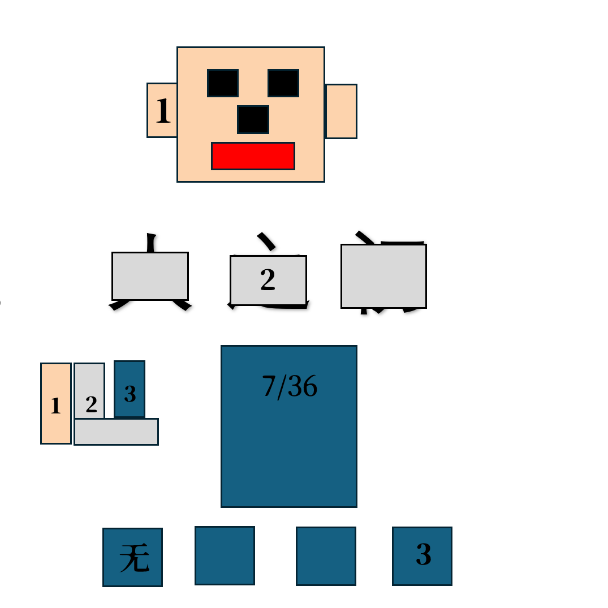

# 千字谜子题 33

## 题面

## 答案

`随`

## 解析

1为人脸的左耳 对应左耳旁
2为人之初 之被遮挡
3为三十六计第七计无中生有 取有
最后组合为随

## 本地附件

- [dfc8847684b1462c89246e47f03125b0.webp](../../../assets/static.cipherpuzzles.com/static/images/dfc8847684b1462c89246e47f03125b0.webp)

来源：[https://ccbc16.cipherpuzzles.com/data/c16-qian-puzzle.json#cid=33](https://ccbc16.cipherpuzzles.com/data/c16-qian-puzzle.json#cid=33)
