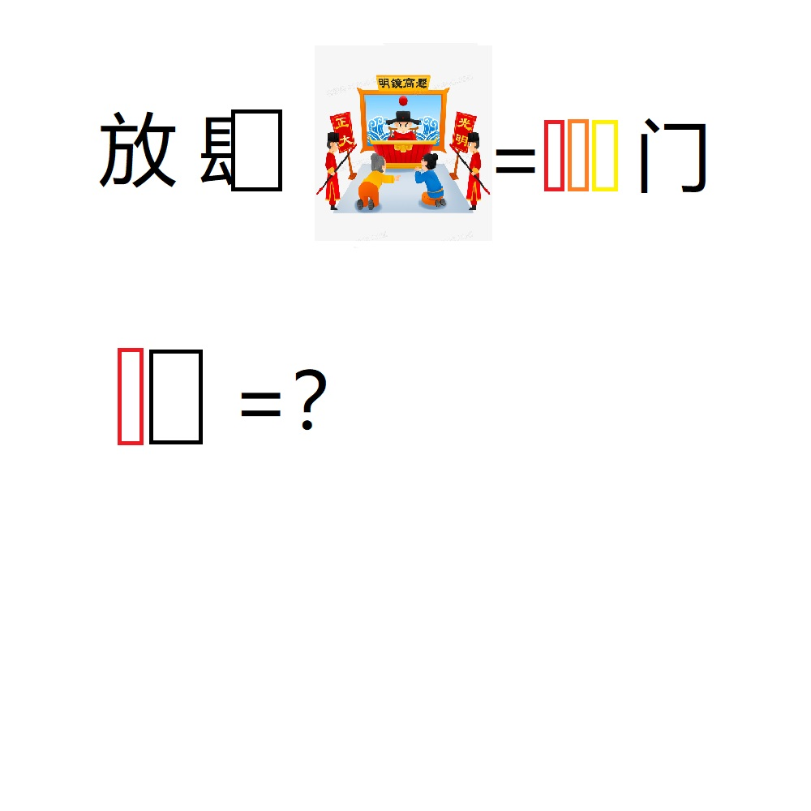

# 千字谜子题 330

## 题面

## 答案

`律`

## 解析

放肆 衙门
取方框中的部首组成“律”

## 本地附件

- [dc35f4aa15c94325804b529041d4c3d1.webp](../../../assets/static.cipherpuzzles.com/static/images/dc35f4aa15c94325804b529041d4c3d1.webp)

来源：[https://ccbc16.cipherpuzzles.com/data/c16-qian-puzzle.json#cid=330](https://ccbc16.cipherpuzzles.com/data/c16-qian-puzzle.json#cid=330)
