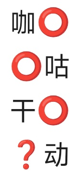

# 千字谜子题 331

## 题面

## 答案

`躁`

## 解析

其余笔画为8，口的数量依次递增，四个空缺为 啡嘀燥躁，答案为？处躁

## 本地附件

- [cefd0ec48d064a91ad7271f353173ce3.webp](../../../assets/static.cipherpuzzles.com/static/images/cefd0ec48d064a91ad7271f353173ce3.webp)

来源：[https://ccbc16.cipherpuzzles.com/data/c16-qian-puzzle.json#cid=331](https://ccbc16.cipherpuzzles.com/data/c16-qian-puzzle.json#cid=331)
