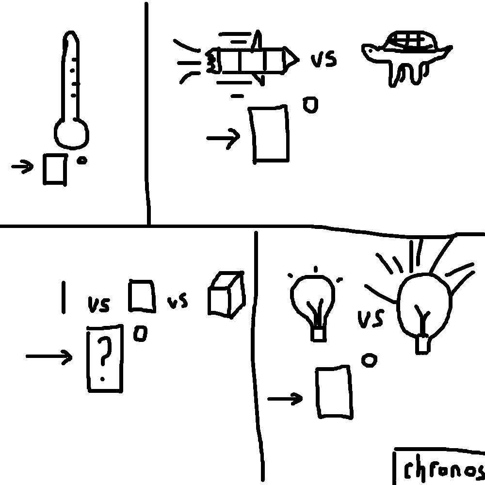

# 千字谜子题 332

## 题面

## 答案

`维`

## 解析

四個圖分別對應溫度，速度，維度以及光度（度以角度符號代替），問號就在【維】字對應答案

## 本地附件

- [8e3672a6acee4e72885372385799977f.webp](../../../assets/static.cipherpuzzles.com/static/images/8e3672a6acee4e72885372385799977f.webp)

来源：[https://ccbc16.cipherpuzzles.com/data/c16-qian-puzzle.json#cid=332](https://ccbc16.cipherpuzzles.com/data/c16-qian-puzzle.json#cid=332)
