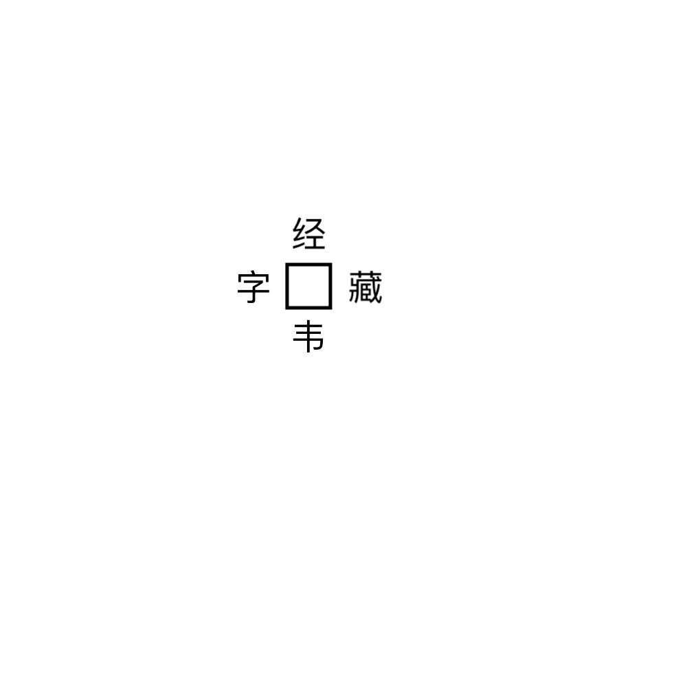

# 千字谜子题 334

## 题面

## 答案

`典`

## 解析

本题是日谜常见的“和同开珎”题目，解题者需要在框内填入一个字，使得上下左右四个方向皆组成词。不难想到“经典”、“字典”、“典藏”、“典韦”，于是可以得到本题答案为【典】。

## 本地附件

- [0254d805df004c4cab7e71aae8afce0b.webp](../../../assets/static.cipherpuzzles.com/static/images/0254d805df004c4cab7e71aae8afce0b.webp)

来源：[https://ccbc16.cipherpuzzles.com/data/c16-qian-puzzle.json#cid=334](https://ccbc16.cipherpuzzles.com/data/c16-qian-puzzle.json#cid=334)
