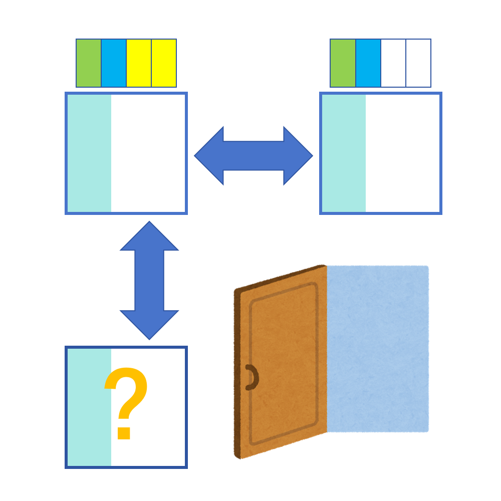

# 千字谜子题 335

## 题面

## 答案

`挫`

## 解析

门的图片和标题暗示上方的两个字是互为反义的“推”和“拉”。根据给出的英文字母匹配可以得知左边是PULL“拉”右边是PUSH“推”。继续使用反义箭头的规律，对“拉”右边的“立”取反义，得到“坐”，结合提手旁可得最终答案“挫”。

## 本地附件

- [defa8fd14ece4af5955ed5fddb5d6437.webp](../../../assets/static.cipherpuzzles.com/static/images/defa8fd14ece4af5955ed5fddb5d6437.webp)

来源：[https://ccbc16.cipherpuzzles.com/data/c16-qian-puzzle.json#cid=335](https://ccbc16.cipherpuzzles.com/data/c16-qian-puzzle.json#cid=335)
