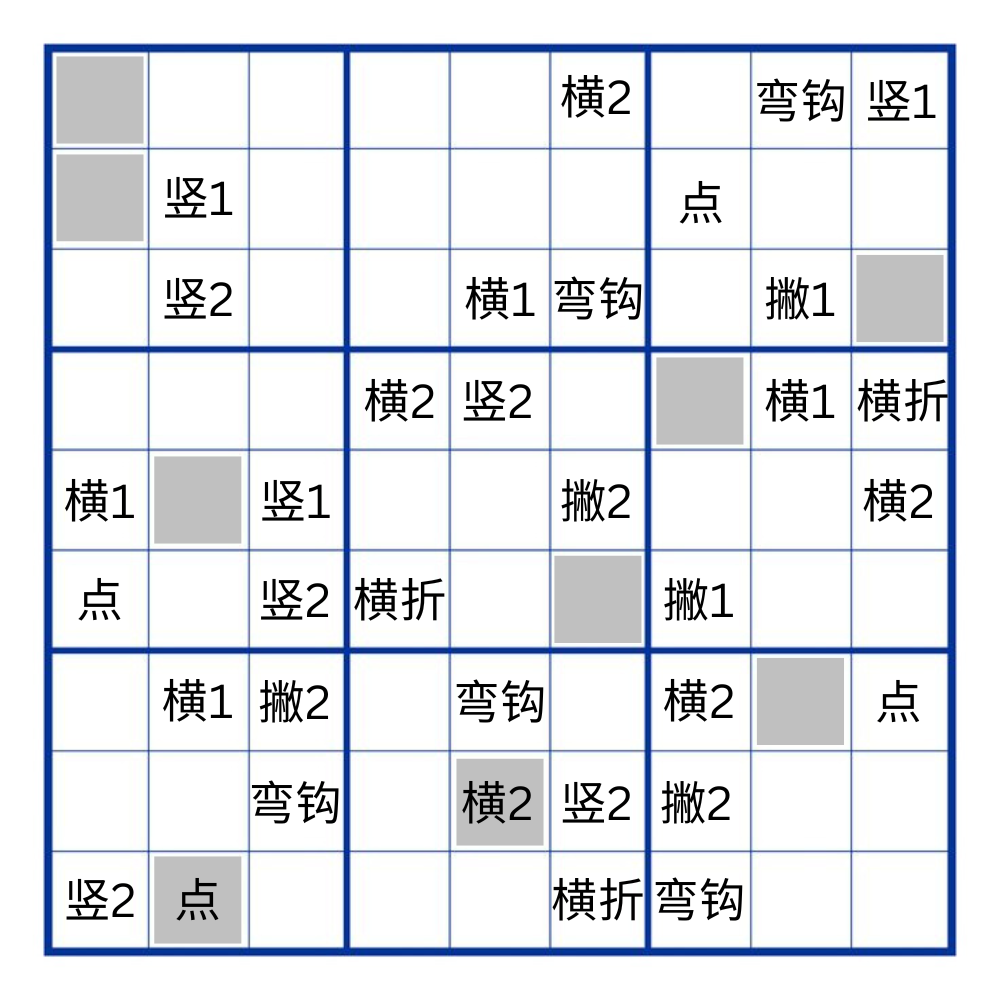

# 千字谜子题 337

## 题面

## 答案

`独`

## 解析

数独解开后从上至下提取灰色区域的笔画组字。

## 本地附件

- [80305fd86d634d5da66a150a446e9947.webp](../../../assets/static.cipherpuzzles.com/static/images/80305fd86d634d5da66a150a446e9947.webp)

来源：[https://ccbc16.cipherpuzzles.com/data/c16-qian-puzzle.json#cid=337](https://ccbc16.cipherpuzzles.com/data/c16-qian-puzzle.json#cid=337)
