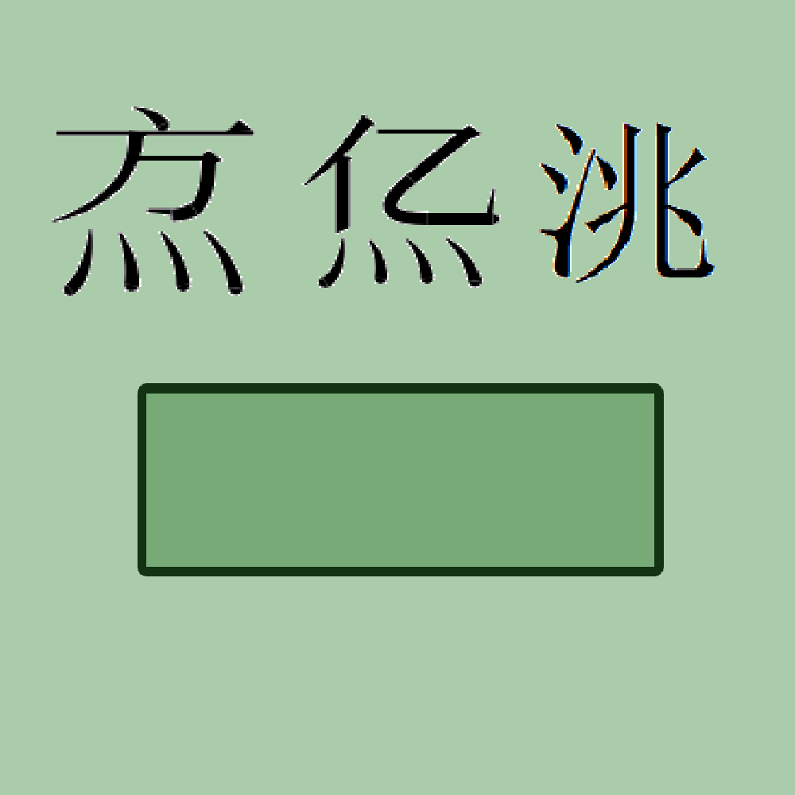

# 千字谜子题 338

## 题面

## 答案

`凉`

## 解析

此题目 三字谜 万亿兆 乃大数 点个数 五四三 下为二 数为京 解为凉。

## 本地附件

- [7a74626c114d40bf9d60e4506b259a9a.webp](../../../assets/static.cipherpuzzles.com/static/images/7a74626c114d40bf9d60e4506b259a9a.webp)

来源：[https://ccbc16.cipherpuzzles.com/data/c16-qian-puzzle.json#cid=338](https://ccbc16.cipherpuzzles.com/data/c16-qian-puzzle.json#cid=338)
