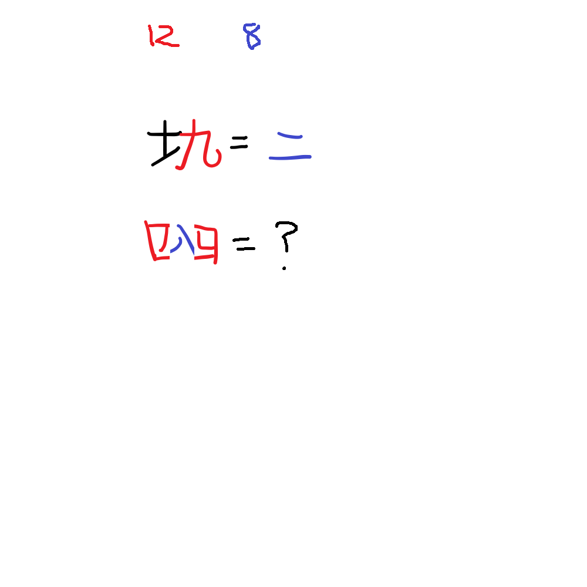

# 千字谜子题 34

## 题面

## 答案

`卿`

## 解析

红色数字是十二地支，蓝色数字是八卦，土+申=坤，把艮放在卯里面就是卿

## 本地附件

- [2face65117774e158617404163e59fec.webp](../../../assets/static.cipherpuzzles.com/static/images/2face65117774e158617404163e59fec.webp)

来源：[https://ccbc16.cipherpuzzles.com/data/c16-qian-puzzle.json#cid=34](https://ccbc16.cipherpuzzles.com/data/c16-qian-puzzle.json#cid=34)
