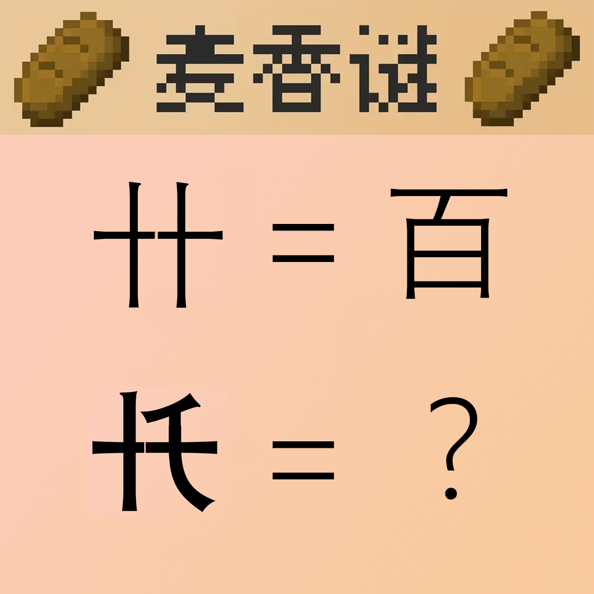

# 千字谜子题 341

## 题面

## 答案

`万`

## 解析

注意到这两个奇怪的字中间明显断开。根据示例“十十”=“百”可知是左右两边所表示的数字做乘法，易得底下“十”x“千”=“万”

## 本地附件

- [f0877f6e83e7413e83dd1435763c7db9.webp](../../../assets/static.cipherpuzzles.com/static/images/f0877f6e83e7413e83dd1435763c7db9.webp)

来源：[https://ccbc16.cipherpuzzles.com/data/c16-qian-puzzle.json#cid=341](https://ccbc16.cipherpuzzles.com/data/c16-qian-puzzle.json#cid=341)
