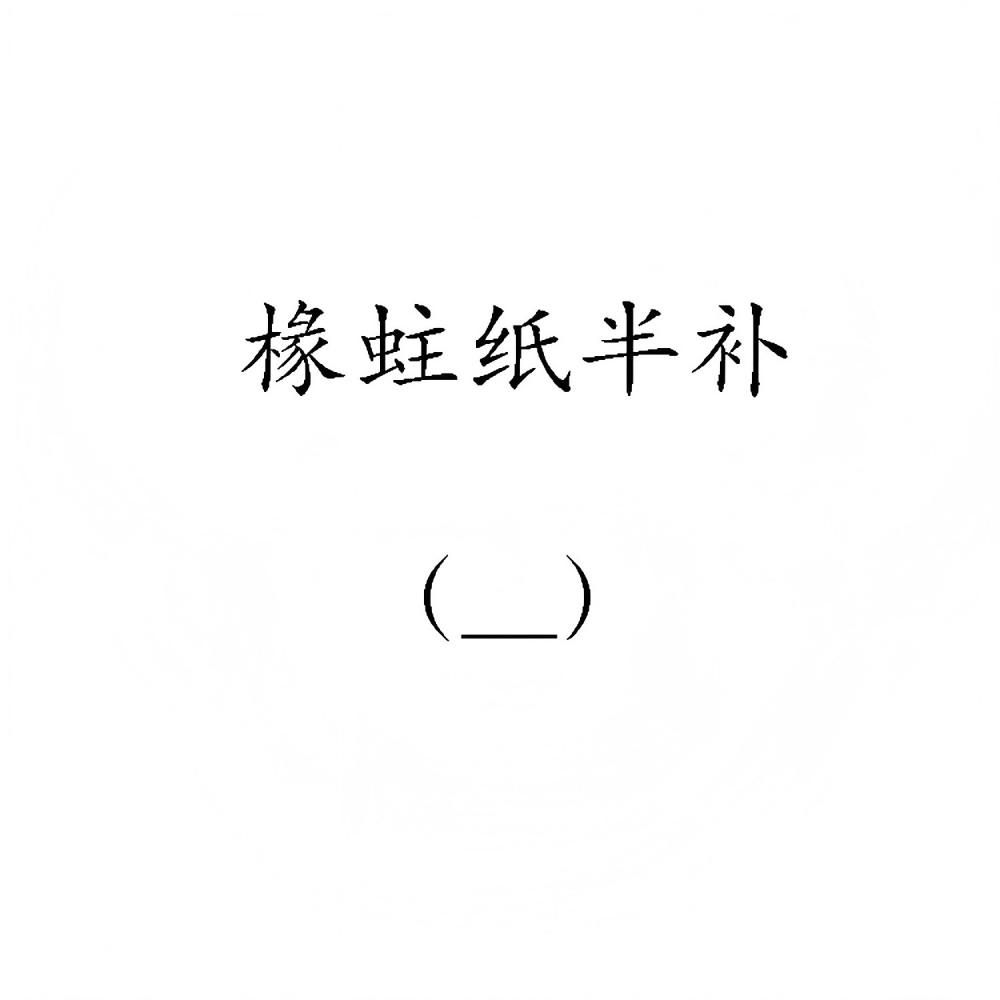

# 千字谜子题 342

## 题面

## 答案

`缘`

## 解析

虫蛀木，纸半纟

## 本地附件

- [fe8f09610abb4e70b7219abfbda555da.webp](../../../assets/static.cipherpuzzles.com/static/images/fe8f09610abb4e70b7219abfbda555da.webp)

来源：[https://ccbc16.cipherpuzzles.com/data/c16-qian-puzzle.json#cid=342](https://ccbc16.cipherpuzzles.com/data/c16-qian-puzzle.json#cid=342)
