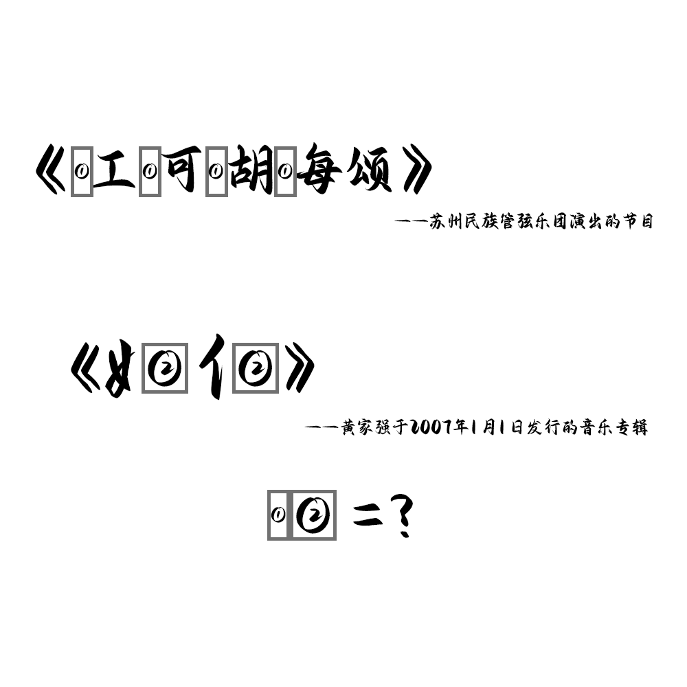

# 千字谜子题 346

## 题面

## 答案

`池`

## 解析

根据两个提示，找到对应的两个作品《江河湖海颂》和《她他》，得到①为三点水旁，②为“也”，最后组成的汉字为“池”

## 本地附件

- [1e2e08870bdf46d8872677823568dcea.webp](../../../assets/static.cipherpuzzles.com/static/images/1e2e08870bdf46d8872677823568dcea.webp)

来源：[https://ccbc16.cipherpuzzles.com/data/c16-qian-puzzle.json#cid=346](https://ccbc16.cipherpuzzles.com/data/c16-qian-puzzle.json#cid=346)
