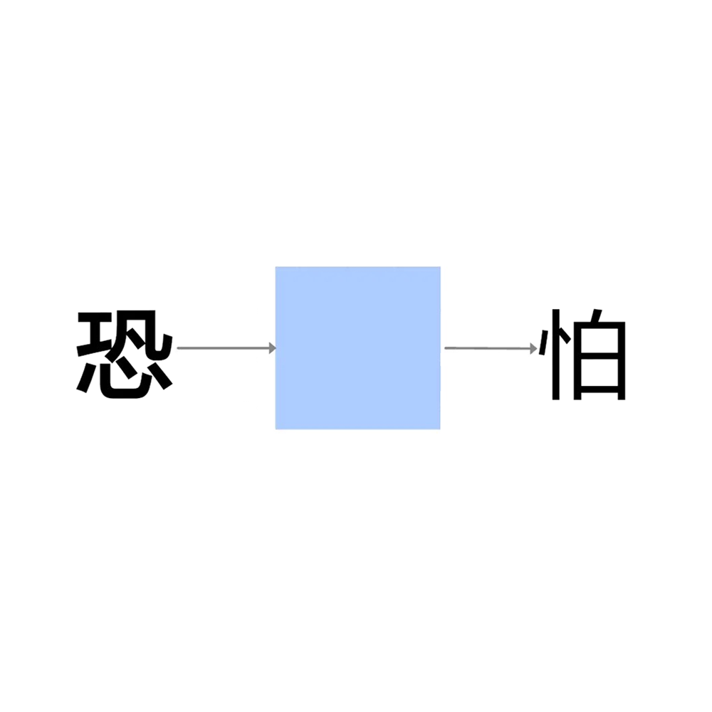

# 千字谜子题 348

## 题面

## 答案

`惧`

## 解析

组词：恐惧、惧怕

## 本地附件

- [b4df77c666864c88886d95e9336414d5.webp](../../../assets/static.cipherpuzzles.com/static/images/b4df77c666864c88886d95e9336414d5.webp)

来源：[https://ccbc16.cipherpuzzles.com/data/c16-qian-puzzle.json#cid=348](https://ccbc16.cipherpuzzles.com/data/c16-qian-puzzle.json#cid=348)
