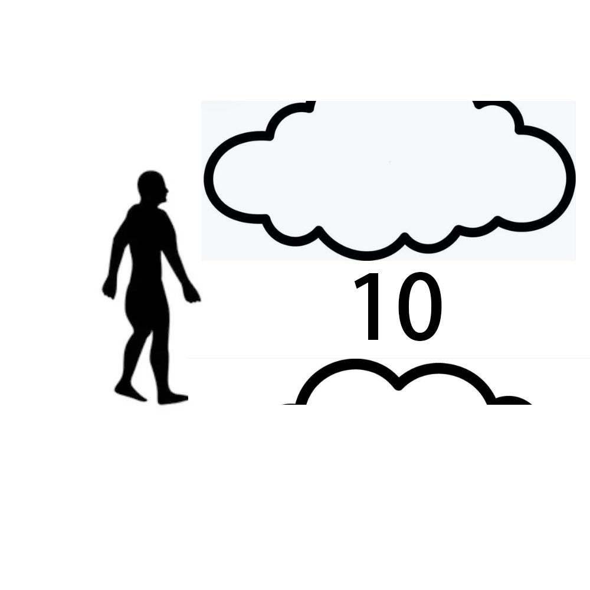

# 千字谜子题 35

## 题面

## 答案

`侄`

## 解析

左边是人，右边上面是云的下半部分，下面是十，以及云的上半部分

## 本地附件

- [bb849e67c7104425bcc106b4aab985b3.webp](../../../assets/static.cipherpuzzles.com/static/images/bb849e67c7104425bcc106b4aab985b3.webp)

来源：[https://ccbc16.cipherpuzzles.com/data/c16-qian-puzzle.json#cid=35](https://ccbc16.cipherpuzzles.com/data/c16-qian-puzzle.json#cid=35)
