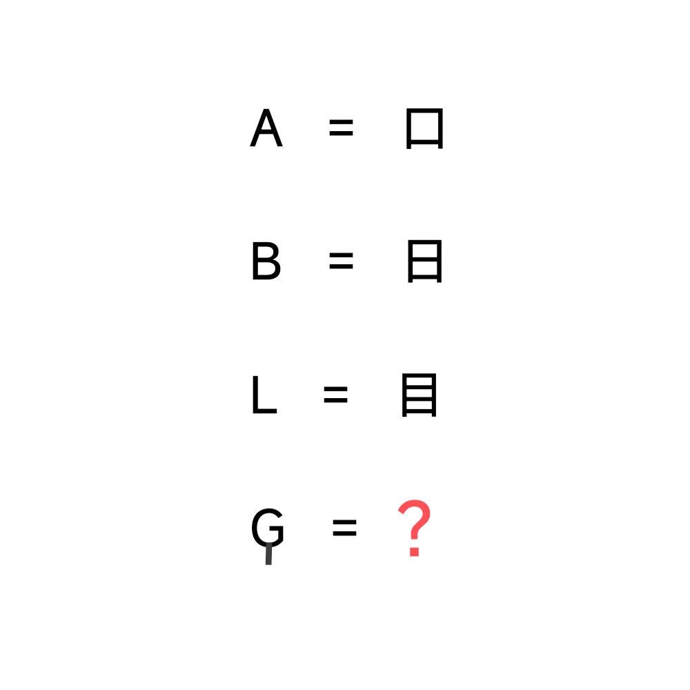

# 千字谜子题 354

## 题面

也许这些字母需要闭眼才能理解…

## 答案

`甲`

## 解析

盲文的象形，注意到G的盲文是四个点组成“田”，与下面的一竖组成甲

## 本地附件

- [1f31070ad91b40f8a8dd63ec60023404.webp](../../../assets/static.cipherpuzzles.com/static/images/1f31070ad91b40f8a8dd63ec60023404.webp)

来源：[https://ccbc16.cipherpuzzles.com/data/c16-qian-puzzle.json#cid=354](https://ccbc16.cipherpuzzles.com/data/c16-qian-puzzle.json#cid=354)
