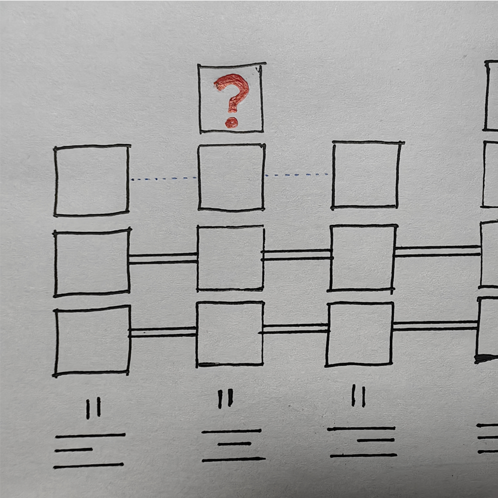

# 千字谜子题 357

## 题面

## 答案

`居`

## 解析

左对齐，【居】中对齐，右对齐（，两端对齐）

## 本地附件

- [82033013764249a4989e032f864ed46c.webp](../../../assets/static.cipherpuzzles.com/static/images/82033013764249a4989e032f864ed46c.webp)

来源：[https://ccbc16.cipherpuzzles.com/data/c16-qian-puzzle.json#cid=357](https://ccbc16.cipherpuzzles.com/data/c16-qian-puzzle.json#cid=357)
