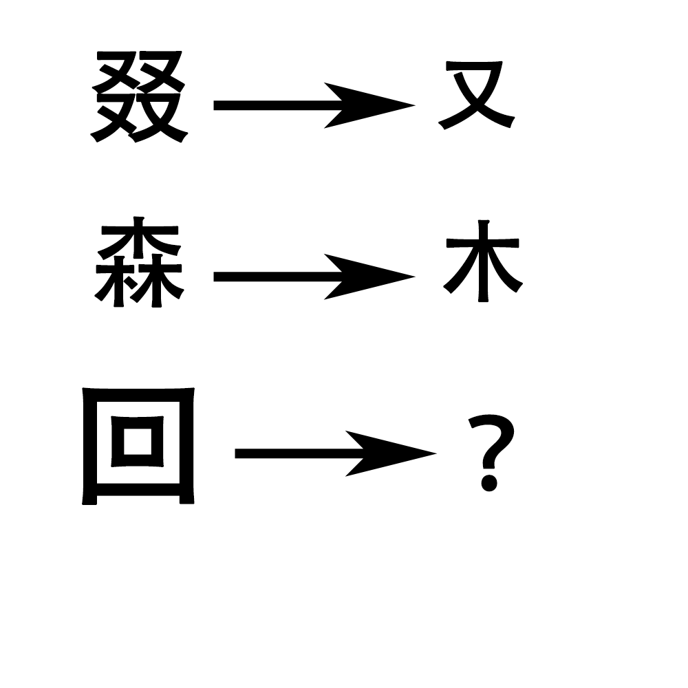

# 千字谜子题 358

## 题面

## 答案

`口`

## 解析

叕是四个又 森是三个口 回是两个口

## 本地附件

- [cb72fd7417624ef3aedf895cc99fca53.webp](../../../assets/static.cipherpuzzles.com/static/images/cb72fd7417624ef3aedf895cc99fca53.webp)

来源：[https://ccbc16.cipherpuzzles.com/data/c16-qian-puzzle.json#cid=358](https://ccbc16.cipherpuzzles.com/data/c16-qian-puzzle.json#cid=358)
