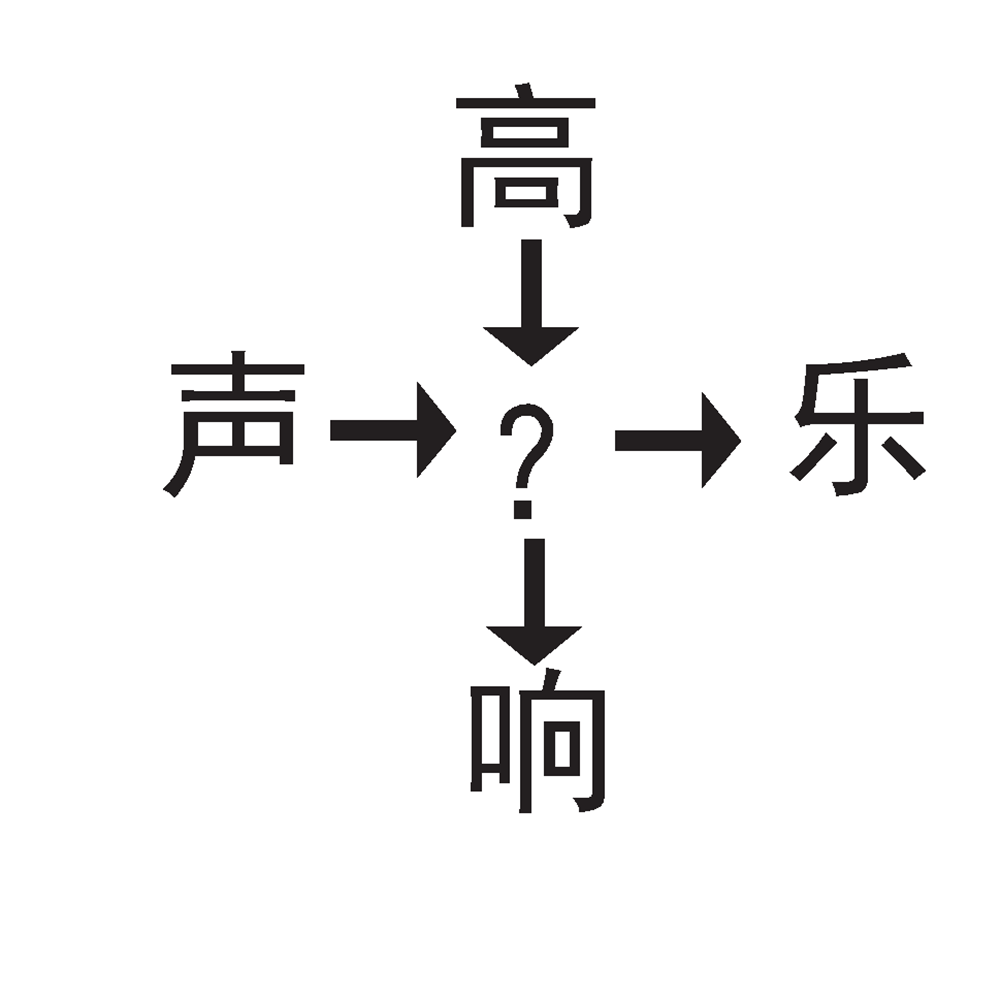

# 千字谜子题 36

## 题面

## 答案

`音`

## 解析

简单字谜~

## 本地附件

- [d8ca27d370c445fab6d24807e7bbe93d.webp](../../../assets/static.cipherpuzzles.com/static/images/d8ca27d370c445fab6d24807e7bbe93d.webp)

来源：[https://ccbc16.cipherpuzzles.com/data/c16-qian-puzzle.json#cid=36](https://ccbc16.cipherpuzzles.com/data/c16-qian-puzzle.json#cid=36)
