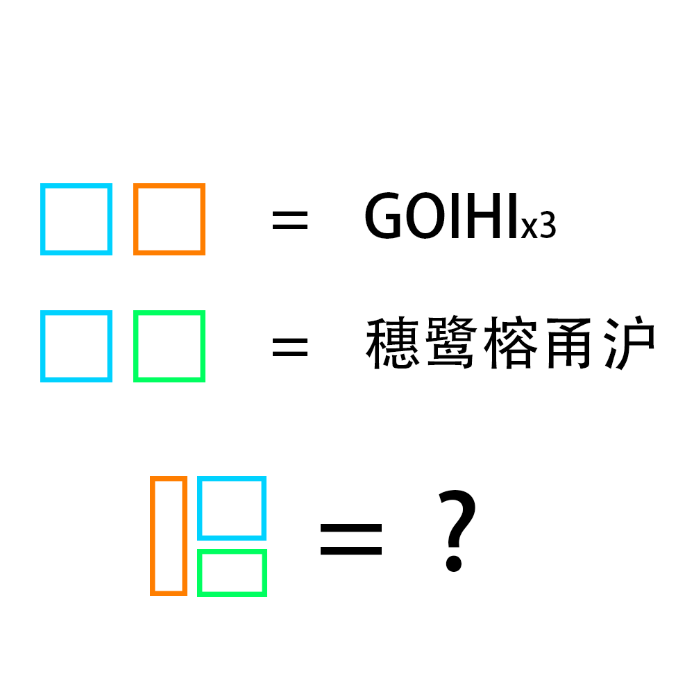

# 千字谜子题 361

## 题面

## 答案

`悟`

## 解析

第一行指三角形的五心，字母分别表示重心，外心，内心，垂心，旁心。
第二行指五口通商的五个城市，穗鹭榕甬沪分别是广州、厦门、福州、宁波、上海的简称。
将心、五、口按照提示组合，可以得到“悟”字

## 本地附件

- [1d1c6280cc994886ae7aeaaa7e4ac9d1.webp](../../../assets/static.cipherpuzzles.com/static/images/1d1c6280cc994886ae7aeaaa7e4ac9d1.webp)

来源：[https://ccbc16.cipherpuzzles.com/data/c16-qian-puzzle.json#cid=361](https://ccbc16.cipherpuzzles.com/data/c16-qian-puzzle.json#cid=361)
