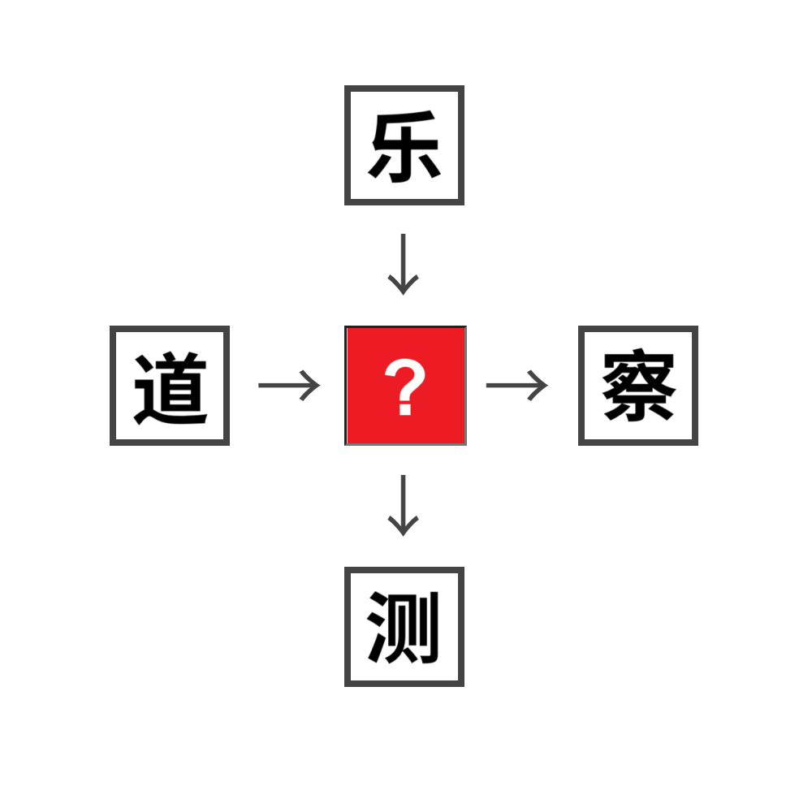

# 千字谜子题 364

## 题面

## 答案

`观`

## 解析

这是一道和同开珎谜题，需要往中心的问号处填入一个字，使得它能够跟旁边的四个字都组成词。
可以注意到【观】字符合要求，【乐观】【道观】【观察】【观测】。
因此答案是观。
（本题已经过焖肉面中文版核查，仅有【观】一字是结果）

## 本地附件

- [cf8580f26be84be9af0ea2fc0ac5f09c.webp](../../../assets/static.cipherpuzzles.com/static/images/cf8580f26be84be9af0ea2fc0ac5f09c.webp)

来源：[https://ccbc16.cipherpuzzles.com/data/c16-qian-puzzle.json#cid=364](https://ccbc16.cipherpuzzles.com/data/c16-qian-puzzle.json#cid=364)
