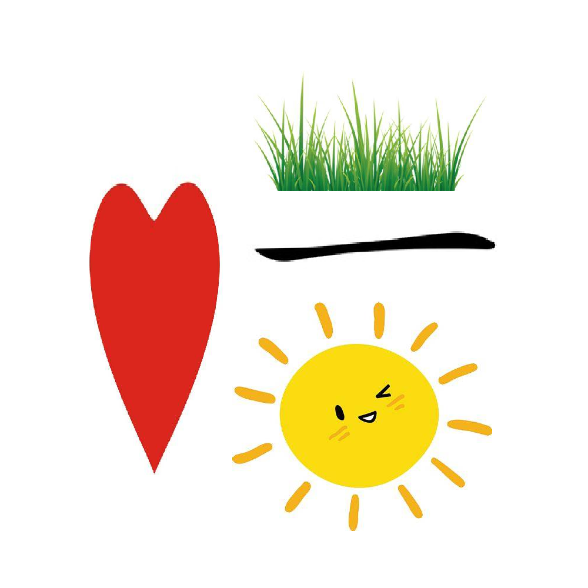

# 千字谜子题 365

## 题面

## 答案

`惜`

## 解析

应该很水吧，解析就不写了。

## 本地附件

- [9530c16a50c94257b0e4116362be6af4.webp](../../../assets/static.cipherpuzzles.com/static/images/9530c16a50c94257b0e4116362be6af4.webp)

来源：[https://ccbc16.cipherpuzzles.com/data/c16-qian-puzzle.json#cid=365](https://ccbc16.cipherpuzzles.com/data/c16-qian-puzzle.json#cid=365)
