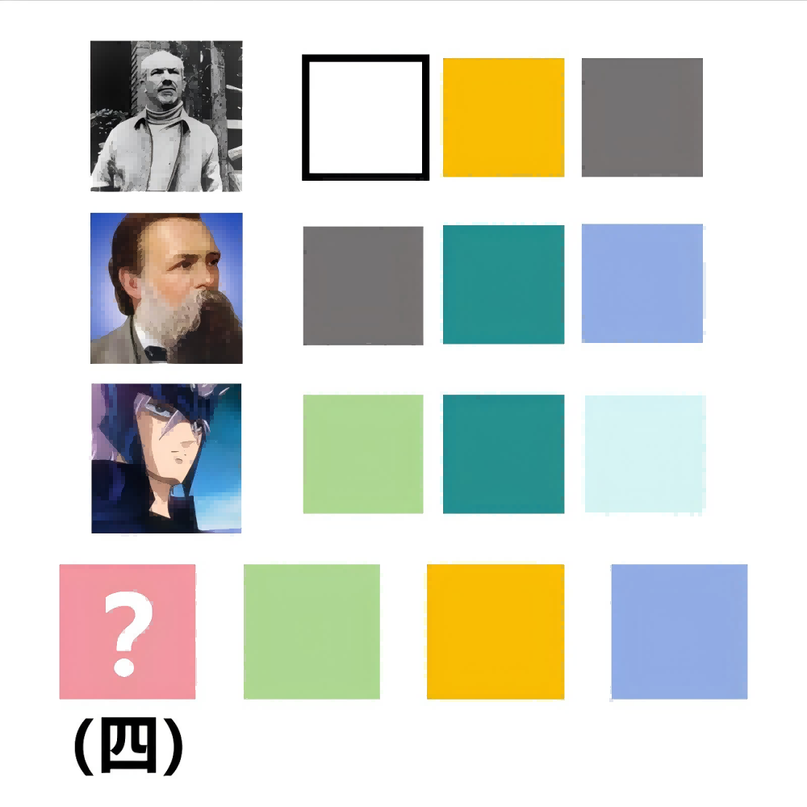

# 千字谜子题 369

## 题面

## 答案

`毛`

## 解析

使用识图功能可知，第1个图片是白求恩，第2个图片是恩格斯，第3个图片是里格尔，由颜色提取出最下面四字为“？里求斯”结合四的笔画提示，可知？=毛

## 本地附件

- [9b7bd9ac83fd412eb2903ade55d9811b.webp](../../../assets/static.cipherpuzzles.com/static/images/9b7bd9ac83fd412eb2903ade55d9811b.webp)

来源：[https://ccbc16.cipherpuzzles.com/data/c16-qian-puzzle.json#cid=369](https://ccbc16.cipherpuzzles.com/data/c16-qian-puzzle.json#cid=369)
