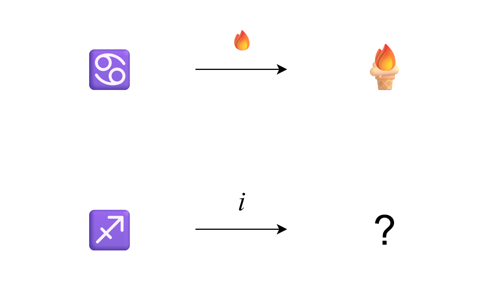

# 千字谜子题 37

## 题面

（十二）

## 答案

`谢`

## 解析

巨蟹座的第一个字巨加上火字旁->炬
射手座的第一个字射加上言字旁->谢

## 本地附件

- [f5660afa43904ffd98c4495a4f9ca664.webp](../../../assets/static.cipherpuzzles.com/static/images/f5660afa43904ffd98c4495a4f9ca664.webp)

来源：[https://ccbc16.cipherpuzzles.com/data/c16-qian-puzzle.json#cid=37](https://ccbc16.cipherpuzzles.com/data/c16-qian-puzzle.json#cid=37)
