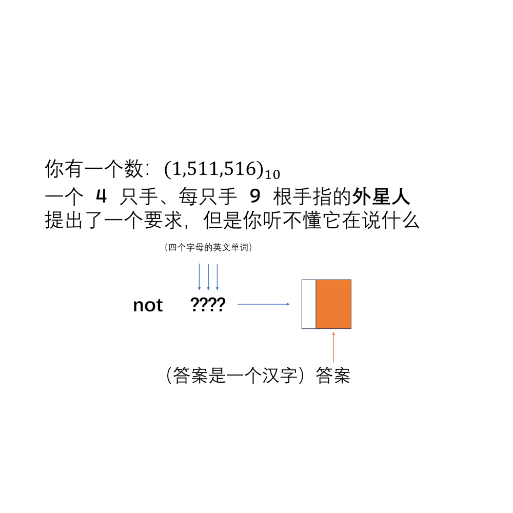

# 千字谜子题 371

## 题面

## 答案

`虽`

## 解析

数字写明了是十进制数，十进制数是十根手指的人用的进制。而 36 根手指的“外星人”就应该用 36 进制，以上这些提示我们将数字转为 36 进制。将 1511516 转为 36 进制后得到 WEAK，恰好是四个字母的单词，意为“弱”。所以，not weak 代表“强”。提取右半部分得到“虽”，因此答案为【虽】。

## 本地附件

- [98b2947806b94805a5754c8d87abd78f.webp](../../../assets/static.cipherpuzzles.com/static/images/98b2947806b94805a5754c8d87abd78f.webp)

来源：[https://ccbc16.cipherpuzzles.com/data/c16-qian-puzzle.json#cid=371](https://ccbc16.cipherpuzzles.com/data/c16-qian-puzzle.json#cid=371)
