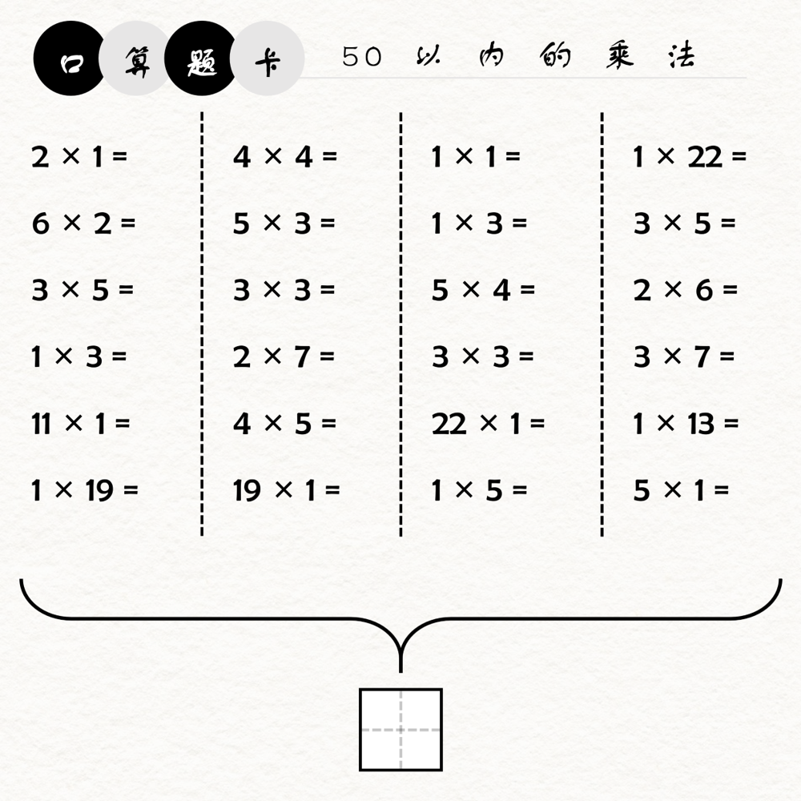

# 千字谜子题 372

## 题面

## 答案

`积`

## 解析

计算图中的所有算式，将每列算式的结果A1Z26得到四个单词：BLOCKS（积木）、POINTS（积分）、ACTIVE（积极）、VOLUME（体积）。结合单词释义，这些单词的意思都恰好含有“积”，而本题本身的乘法计算得出的也是“积”，因此总结出答案即为“积”。

## 本地附件

- [5897f08c419143d1b21624b5b5879daf.webp](../../../assets/static.cipherpuzzles.com/static/images/5897f08c419143d1b21624b5b5879daf.webp)

来源：[https://ccbc16.cipherpuzzles.com/data/c16-qian-puzzle.json#cid=372](https://ccbc16.cipherpuzzles.com/data/c16-qian-puzzle.json#cid=372)
