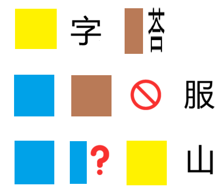

# 千字谜子题 375

## 题面

## 答案

`曼`

## 解析

本题的主题是“五行”，结合五行对应其颜色得到下面三个词语：金字塔，水土不服，水漫金山。提取漫的右边部分得到答案“曼”。

## 本地附件

- [0aa8d728b22e41b3add8dc62968c6481.webp](../../../assets/static.cipherpuzzles.com/static/images/0aa8d728b22e41b3add8dc62968c6481.webp)

来源：[https://ccbc16.cipherpuzzles.com/data/c16-qian-puzzle.json#cid=375](https://ccbc16.cipherpuzzles.com/data/c16-qian-puzzle.json#cid=375)
