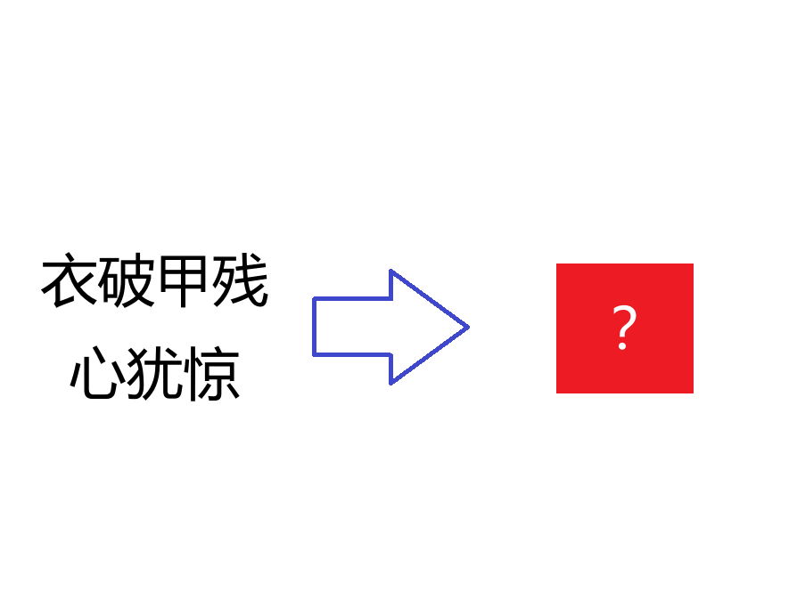

# 千字谜子题 377

## 题面

## 答案

`畏`

## 解析

衣破甲残心犹惊 字谜
衣-点+甲不出头=畏 （心犹惊）

## 本地附件

- [ad33809b26134845b3f5a03c68525e06.webp](../../../assets/static.cipherpuzzles.com/static/images/ad33809b26134845b3f5a03c68525e06.webp)

来源：[https://ccbc16.cipherpuzzles.com/data/c16-qian-puzzle.json#cid=377](https://ccbc16.cipherpuzzles.com/data/c16-qian-puzzle.json#cid=377)
