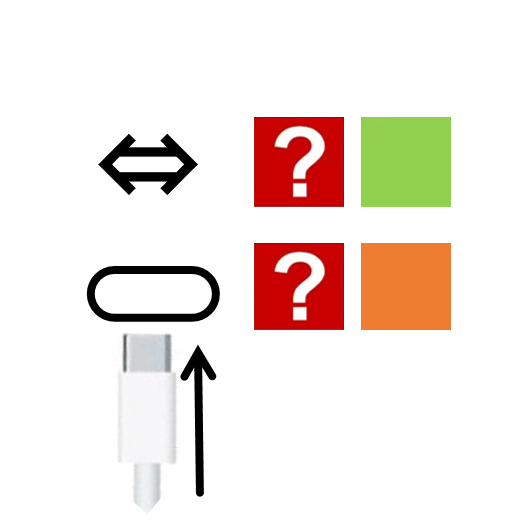

# 千字谜子题 38

## 题面

（六）

## 答案

`充`

## 解析

上面是充要，下面是充电，答案是充（一开始觉得两个形状有点像，做出来发现一点都不像（））

## 本地附件

- [44bcb1afe2a14a409f86903ab836ca5f.webp](../../../assets/static.cipherpuzzles.com/static/images/44bcb1afe2a14a409f86903ab836ca5f.webp)

来源：[https://ccbc16.cipherpuzzles.com/data/c16-qian-puzzle.json#cid=38](https://ccbc16.cipherpuzzles.com/data/c16-qian-puzzle.json#cid=38)
