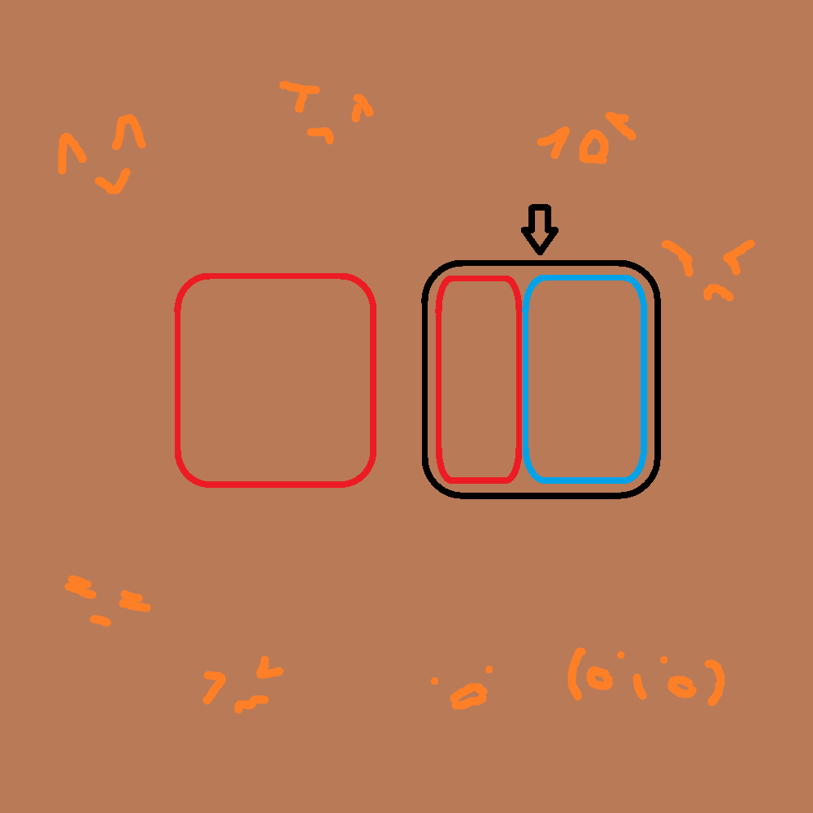

# 千字谜子题 381

## 题面

## 答案

`情`

## 解析

根据周围的表情和方框可以猜出词语是“心情”，然后根据箭头指向提取“情”。

## 本地附件

- [06e0556186c3474e8ca8c18cd9111403.webp](../../../assets/static.cipherpuzzles.com/static/images/06e0556186c3474e8ca8c18cd9111403.webp)

来源：[https://ccbc16.cipherpuzzles.com/data/c16-qian-puzzle.json#cid=381](https://ccbc16.cipherpuzzles.com/data/c16-qian-puzzle.json#cid=381)
