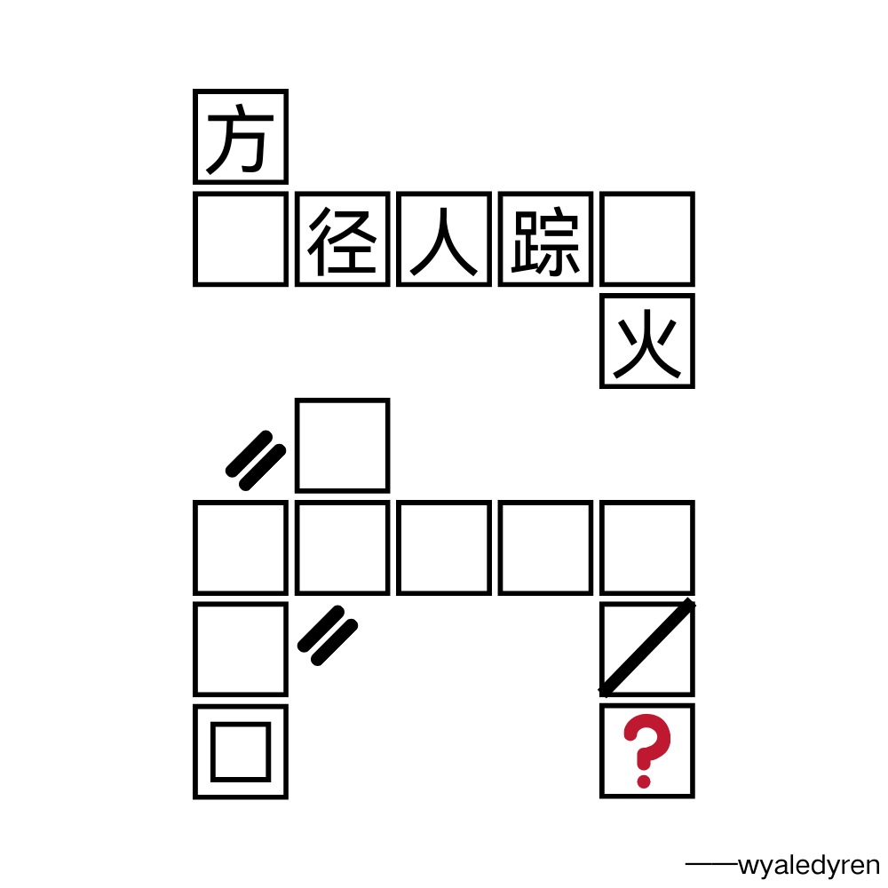

# 千字谜子题 382

## 题面

## 答案

`尺`

## 解析

横向为诗句，纵向为加减笔画；下方诗句为白日依山尽，尽减去两笔为尺

## 本地附件

- [1ca8f33677ae4624818c9fc91421e3b2.webp](../../../assets/static.cipherpuzzles.com/static/images/1ca8f33677ae4624818c9fc91421e3b2.webp)

来源：[https://ccbc16.cipherpuzzles.com/data/c16-qian-puzzle.json#cid=382](https://ccbc16.cipherpuzzles.com/data/c16-qian-puzzle.json#cid=382)
