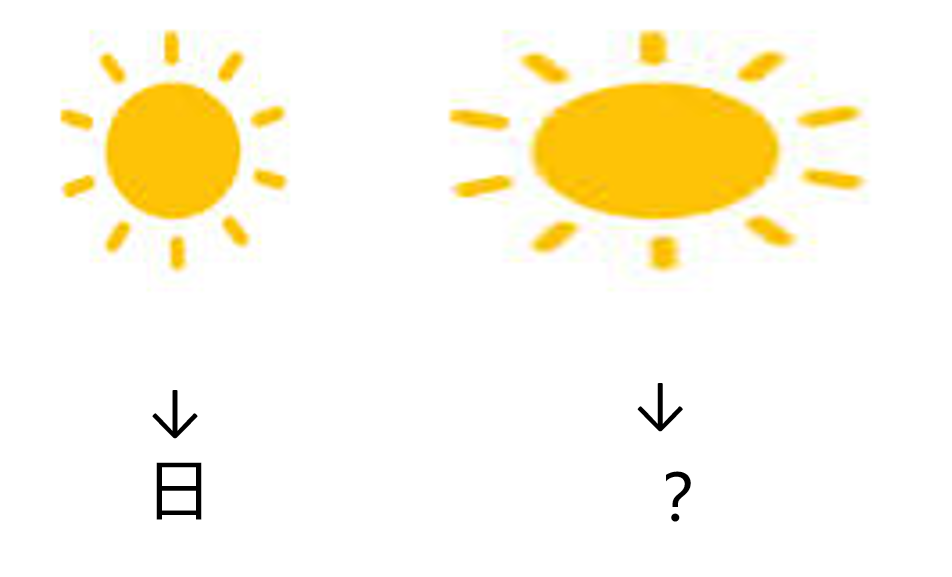

# 千字谜子题 385

## 题面

## 答案

`曰`

## 解析

将“日”笔画横向拉长得到“曰”。

## 本地附件

- [94698ff1beae4de7889e84793eaaccf4.webp](../../../assets/static.cipherpuzzles.com/static/images/94698ff1beae4de7889e84793eaaccf4.webp)

来源：[https://ccbc16.cipherpuzzles.com/data/c16-qian-puzzle.json#cid=385](https://ccbc16.cipherpuzzles.com/data/c16-qian-puzzle.json#cid=385)
