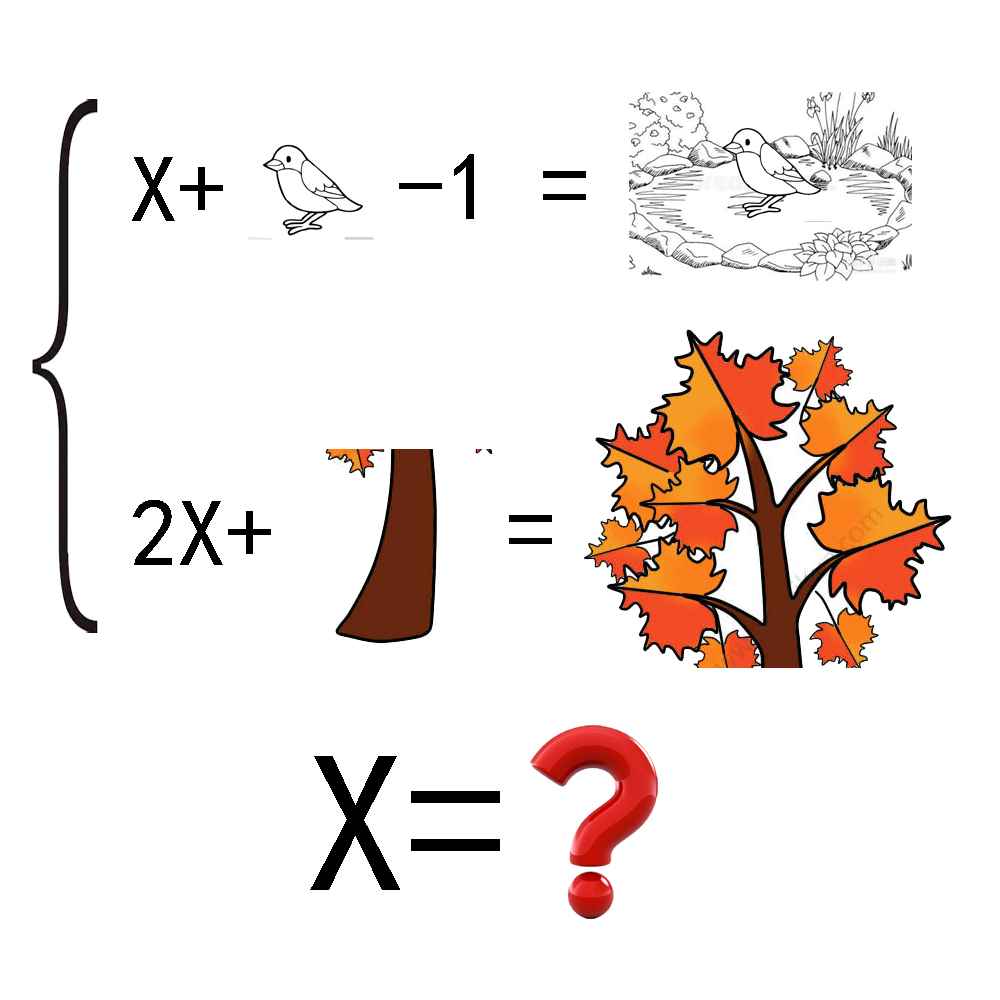

# 千字谜子题 386

## 题面

## 答案

`几`

## 解析

几+鸟-一＝凫＝水鸟
几+X+木=枫

## 本地附件

- [83ccc3478844427babba6f286ff30f2d.webp](../../../assets/static.cipherpuzzles.com/static/images/83ccc3478844427babba6f286ff30f2d.webp)

来源：[https://ccbc16.cipherpuzzles.com/data/c16-qian-puzzle.json#cid=386](https://ccbc16.cipherpuzzles.com/data/c16-qian-puzzle.json#cid=386)
