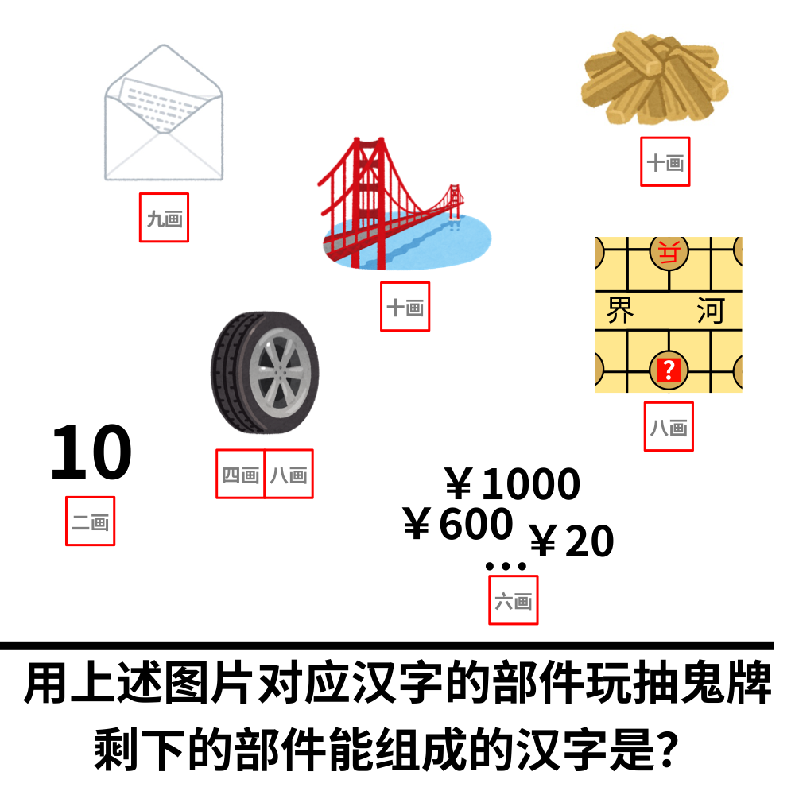

# 千字谜子题 39

## 题面

## 答案

`跃`

## 解析

根据画数提示，得到图片对应的汉字是“信”“柴”“桥”“车轮”“卒”“十”“价”，用它们的部件玩抽鬼牌（即删去出现偶数次的部件）后，剩下的部件为“口”“止”“夭”，组合得到汉字“跃”。

## 本地附件

- [13854d307fda4cea8b6860ed87aa13c4.webp](../../../assets/static.cipherpuzzles.com/static/images/13854d307fda4cea8b6860ed87aa13c4.webp)

来源：[https://ccbc16.cipherpuzzles.com/data/c16-qian-puzzle.json#cid=39](https://ccbc16.cipherpuzzles.com/data/c16-qian-puzzle.json#cid=39)
