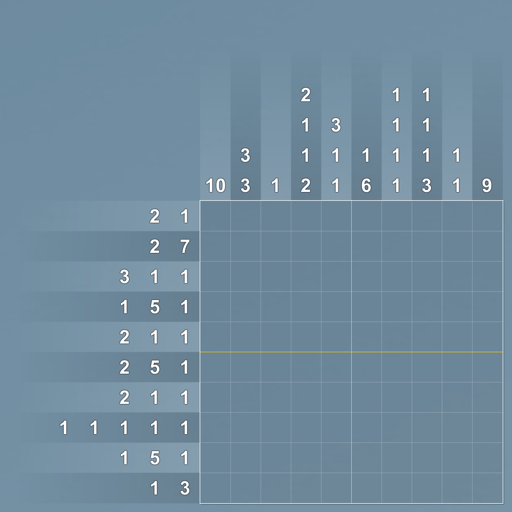

# 千字谜子题 390

## 题面

## 答案

`陶`

## 解析

数图游戏：游戏棋盘是一张正方形网格，其中的每个格子最终需要涂成黑色或标记为X。 棋盘每一行左边或每一列上方的数字和该行或该列上每一组相邻的黑色方格的长度以相同顺序一一对应。 游戏目标是要找出所有的黑色方格。
黑色方格连起来答案是陶

## 本地附件

- [56eea4da3c084f0f88743931d2d1717d.webp](../../../assets/static.cipherpuzzles.com/static/images/56eea4da3c084f0f88743931d2d1717d.webp)

来源：[https://ccbc16.cipherpuzzles.com/data/c16-qian-puzzle.json#cid=390](https://ccbc16.cipherpuzzles.com/data/c16-qian-puzzle.json#cid=390)
