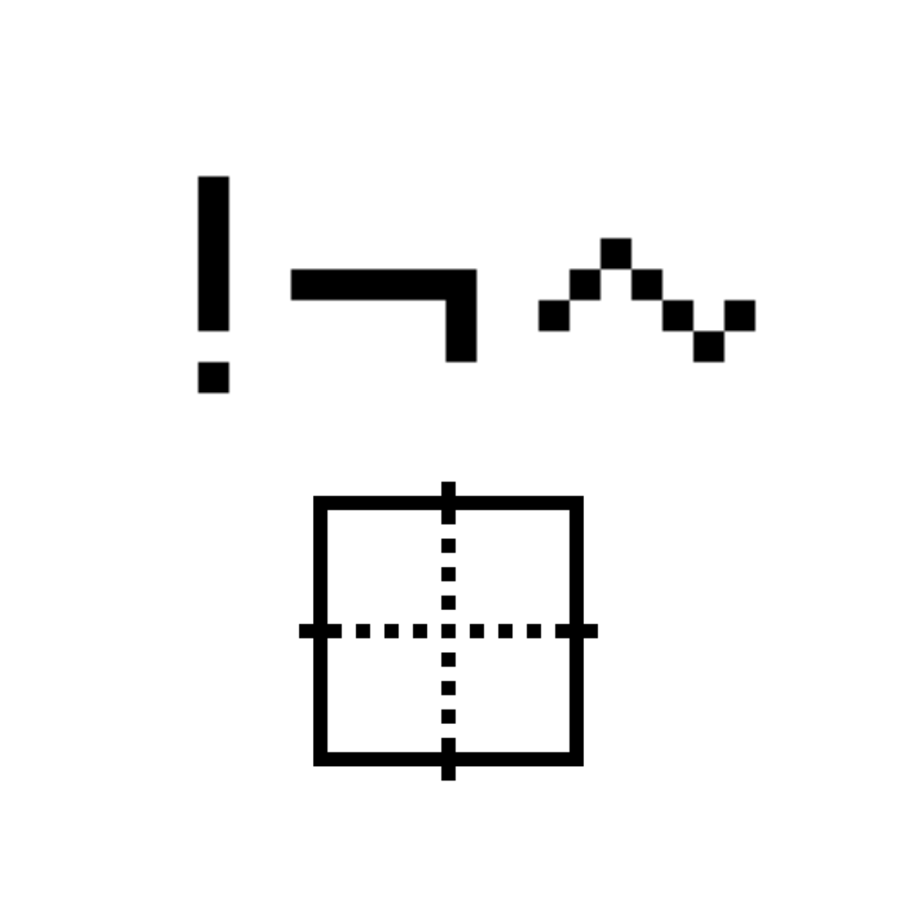

# 千字谜子题 392

## 题面

## 答案

`非`

## 解析

！¬ ~都是代表“非”的符号。下方的方框表示答案是一个上下对称以及左右对称的汉字。

## 本地附件

- [ad0f2a902b744548a45074884b4f6543.webp](../../../assets/static.cipherpuzzles.com/static/images/ad0f2a902b744548a45074884b4f6543.webp)

来源：[https://ccbc16.cipherpuzzles.com/data/c16-qian-puzzle.json#cid=392](https://ccbc16.cipherpuzzles.com/data/c16-qian-puzzle.json#cid=392)
