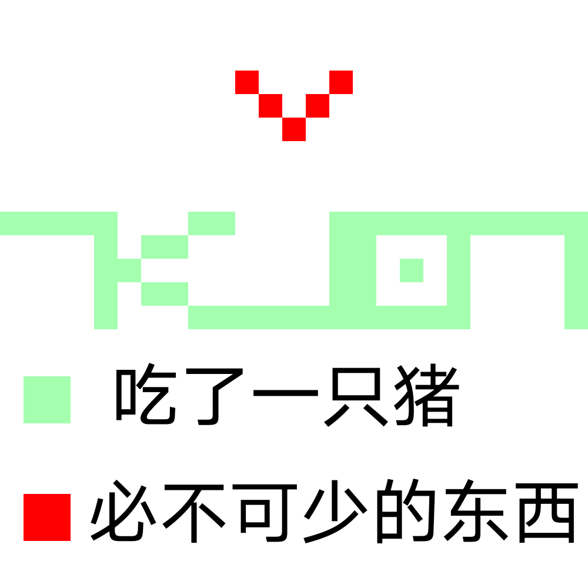

# 千字谜子题 394

## 题面

## 答案

`广`

## 解析

薄荷色是猪笼解出字母，红色是声调

## 本地附件

- [4664f1bfa83f4d0c8f9dccb9ee41c2f3.webp](../../../assets/static.cipherpuzzles.com/static/images/4664f1bfa83f4d0c8f9dccb9ee41c2f3.webp)

来源：[https://ccbc16.cipherpuzzles.com/data/c16-qian-puzzle.json#cid=394](https://ccbc16.cipherpuzzles.com/data/c16-qian-puzzle.json#cid=394)
