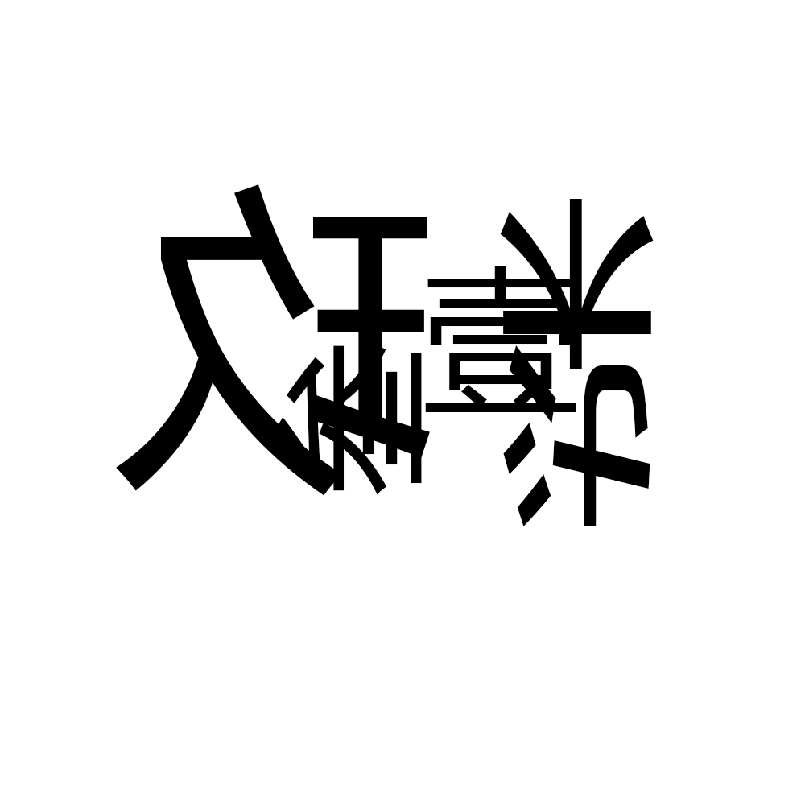

# 千字谜子题 395

## 题面

## 答案

`刷`

## 解析

将汉字转换成阿拉伯数字后，根据相应翻转或旋转象形得到“刷”。

## 本地附件

- [e73c813dbde641488f78b77ee6c3b28b.webp](../../../assets/static.cipherpuzzles.com/static/images/e73c813dbde641488f78b77ee6c3b28b.webp)

来源：[https://ccbc16.cipherpuzzles.com/data/c16-qian-puzzle.json#cid=395](https://ccbc16.cipherpuzzles.com/data/c16-qian-puzzle.json#cid=395)
