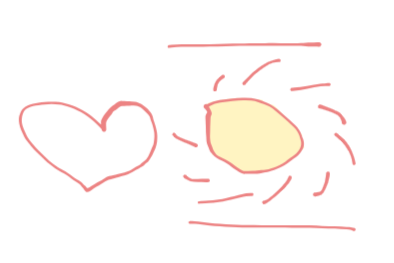

# 千字谜子题 396

## 题面

## 答案

`恒`

## 解析

拼字

## 本地附件

- [f4fc35c5a2e5490d887c6534777d0e7a.webp](../../../assets/static.cipherpuzzles.com/static/images/f4fc35c5a2e5490d887c6534777d0e7a.webp)

来源：[https://ccbc16.cipherpuzzles.com/data/c16-qian-puzzle.json#cid=396](https://ccbc16.cipherpuzzles.com/data/c16-qian-puzzle.json#cid=396)
