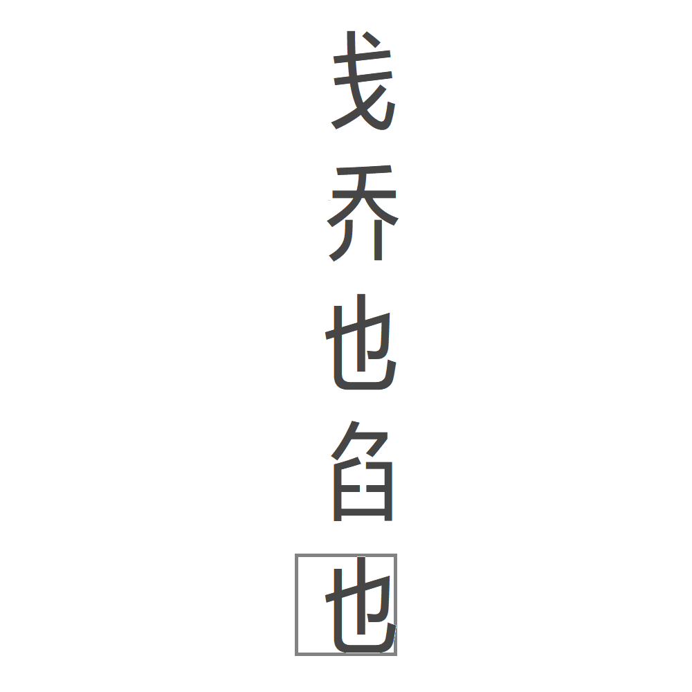

# 千字谜子题 40

## 题面

## 答案

`地`

## 解析

金钱 木桥 水池 火焰 土地
方框和字的比例提示左边还要加上偏旁，五个字的共同特点是偏旁本身和这个字可以组词。并且分别使用了五行。应该是比较强的doublecheck
不知道为什么电脑抽风调不了方框颜色，但总之那个灰色方框表示答案。

## 本地附件

- [90a7da13b7d94532b1f75fcb430b5403.webp](../../../assets/static.cipherpuzzles.com/static/images/90a7da13b7d94532b1f75fcb430b5403.webp)

来源：[https://ccbc16.cipherpuzzles.com/data/c16-qian-puzzle.json#cid=40](https://ccbc16.cipherpuzzles.com/data/c16-qian-puzzle.json#cid=40)
