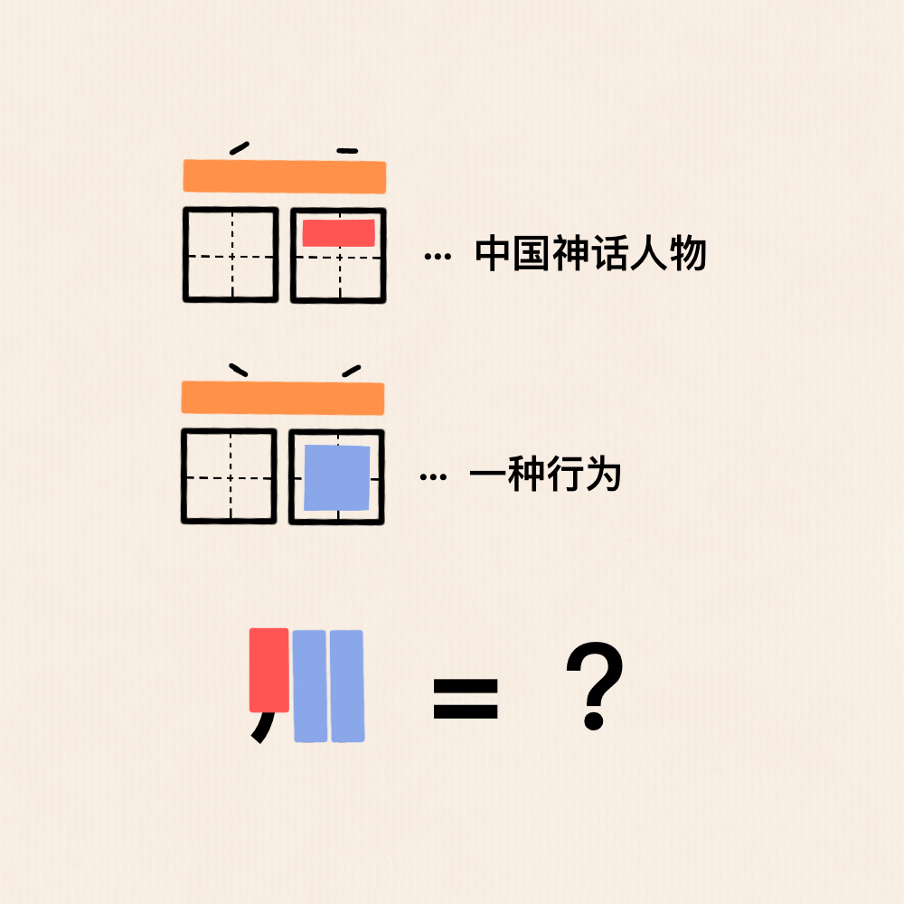

# 千字谜子题 400

## 题面

## 答案

`翔`

## 解析

田字格代表汉字，上方的橙色部分代表拼音，结合声调可知上下两个词语读音只有声调不同，再结合右侧提示可知上方词语为“伏羲”，下方词语为“复习”，而红色部分为“羊”（的上半部分？），蓝色部分为“习”，结合下方图形得到“翔”字。

## 本地附件

- [d554b21967804b3a9ff3fa13973a8d8c.webp](../../../assets/static.cipherpuzzles.com/static/images/d554b21967804b3a9ff3fa13973a8d8c.webp)

来源：[https://ccbc16.cipherpuzzles.com/data/c16-qian-puzzle.json#cid=400](https://ccbc16.cipherpuzzles.com/data/c16-qian-puzzle.json#cid=400)
