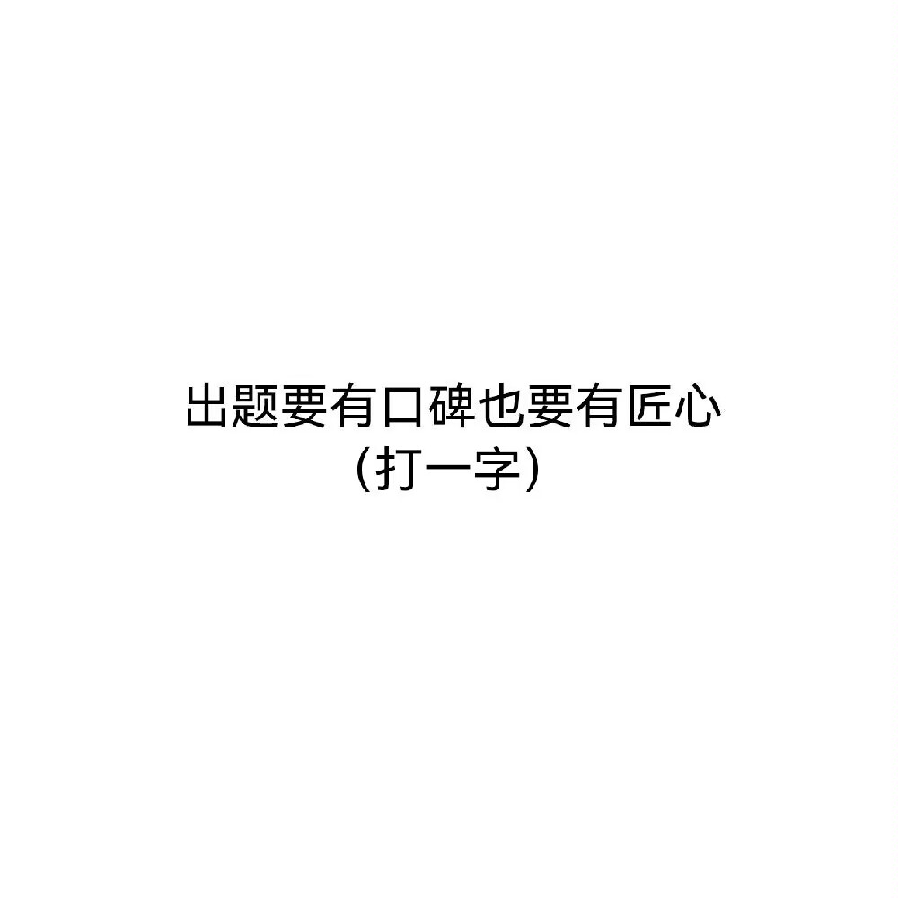

# 千字谜子题 402

## 题面

## 答案

`听`

## 解析

匠心意味着斤，加上口字旁(口碑)，然后就是听。

## 本地附件

- [b8bab4efcd8a486db6996837f51e0120.webp](../../../assets/static.cipherpuzzles.com/static/images/b8bab4efcd8a486db6996837f51e0120.webp)

来源：[https://ccbc16.cipherpuzzles.com/data/c16-qian-puzzle.json#cid=402](https://ccbc16.cipherpuzzles.com/data/c16-qian-puzzle.json#cid=402)
