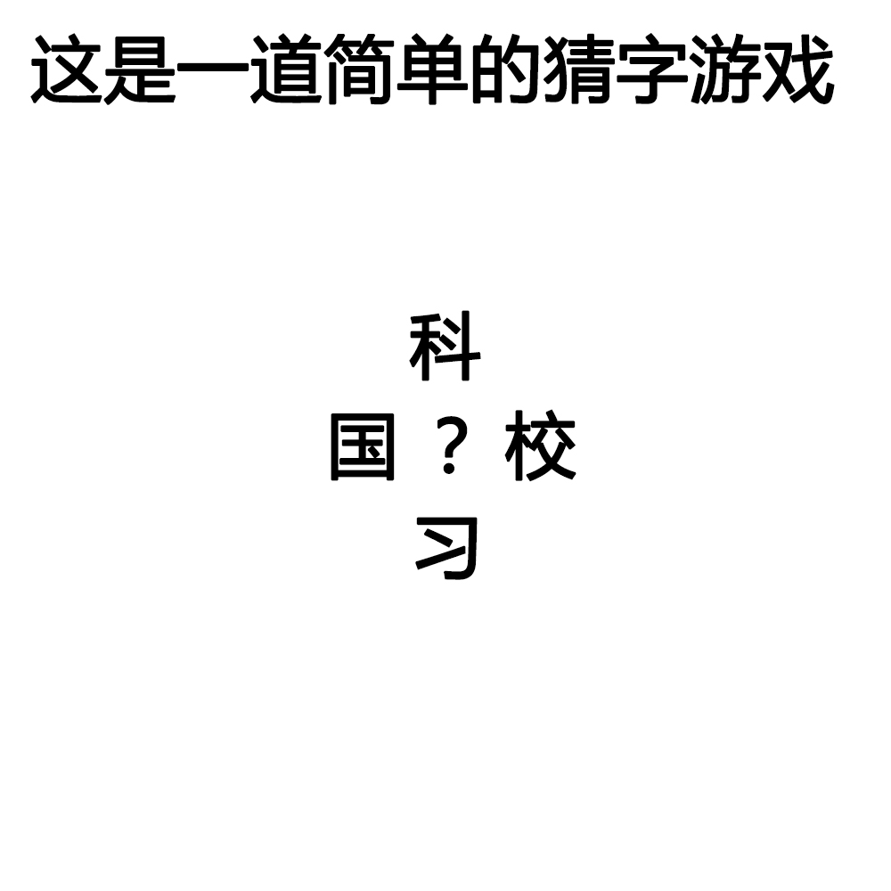

# 千字谜子题 403

## 题面

## 答案

`学`

## 解析

横向 国学 学校
纵向 科学 学习

## 本地附件

- [8479c63127b6400eb75603492502db63.webp](../../../assets/static.cipherpuzzles.com/static/images/8479c63127b6400eb75603492502db63.webp)

来源：[https://ccbc16.cipherpuzzles.com/data/c16-qian-puzzle.json#cid=403](https://ccbc16.cipherpuzzles.com/data/c16-qian-puzzle.json#cid=403)
