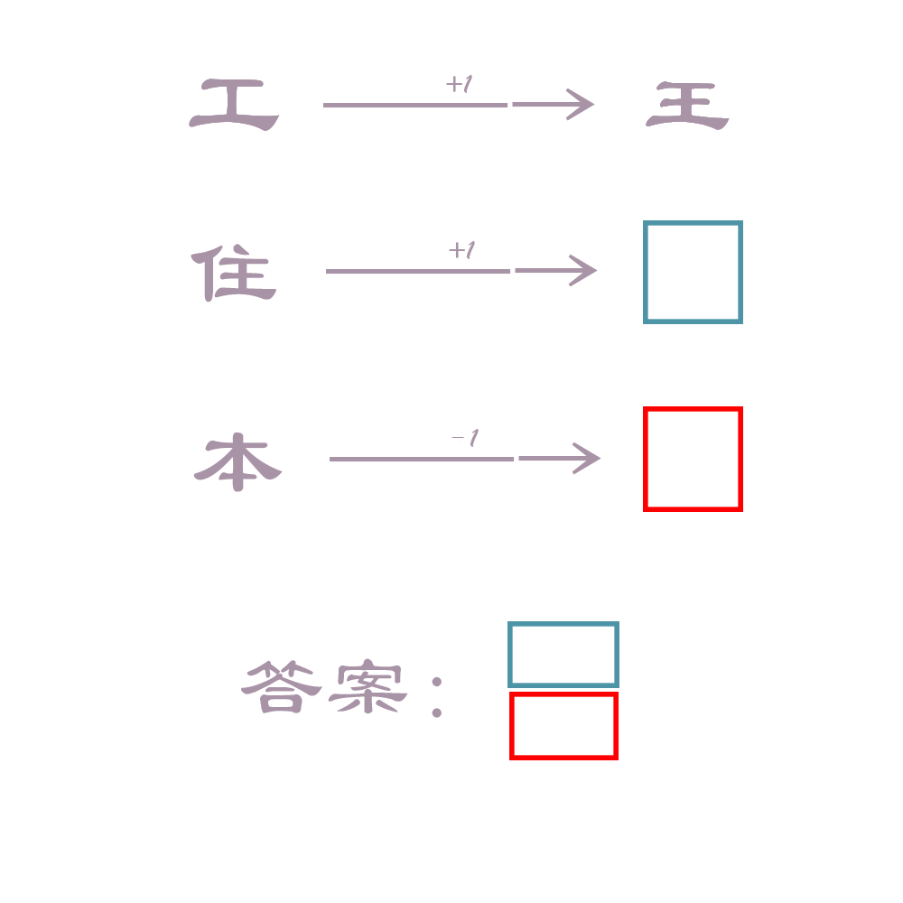

# 千字谜子题 404

## 题面

## 答案

`集`

## 解析

+1/-1代表加一根横杠或减一根横杠，“住”+1=“隹”，“本”-1=“木”

## 本地附件

- [e886472a6f0e48afaa39d4325807196c.webp](../../../assets/static.cipherpuzzles.com/static/images/e886472a6f0e48afaa39d4325807196c.webp)

来源：[https://ccbc16.cipherpuzzles.com/data/c16-qian-puzzle.json#cid=404](https://ccbc16.cipherpuzzles.com/data/c16-qian-puzzle.json#cid=404)
