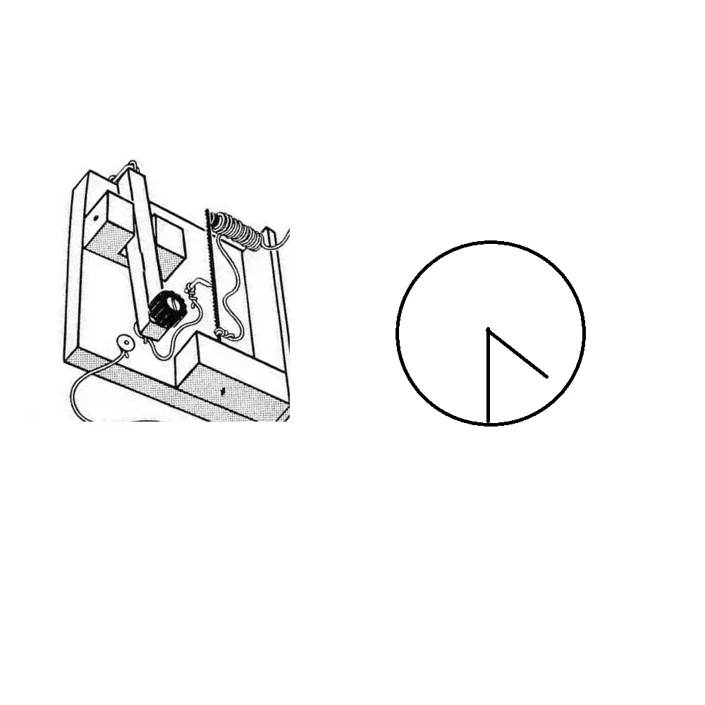

# 千字谜子题 407

## 题面

## 答案

`幸`

## 解析

画的比较抽象，左边发报机联想电码，右边联想时钟四点半，1630中文电码为幸

## 本地附件

- [16a209618a534e1aa4408963fc1be51e.webp](../../../assets/static.cipherpuzzles.com/static/images/16a209618a534e1aa4408963fc1be51e.webp)

来源：[https://ccbc16.cipherpuzzles.com/data/c16-qian-puzzle.json#cid=407](https://ccbc16.cipherpuzzles.com/data/c16-qian-puzzle.json#cid=407)
