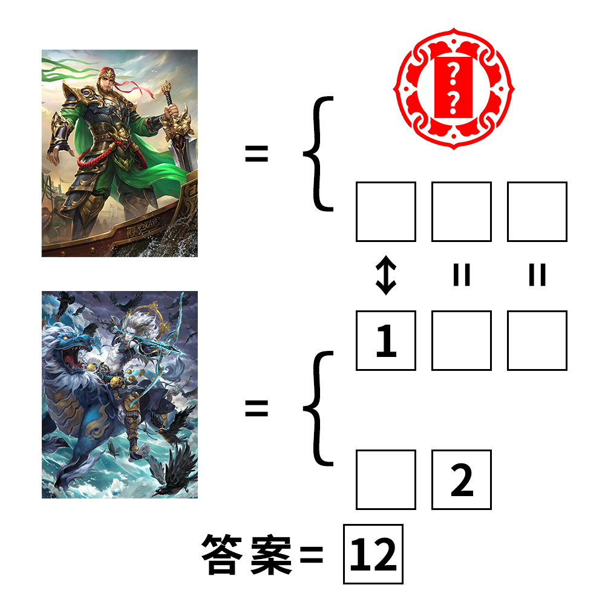

# 千字谜子题 409

## 题面

## 答案

`魄`

## 解析

识图可得两个人物分别为界徐盛和神甘宁，且右上角为“大宝”，因此得出本题的等号表示绰号，而界徐盛和神甘宁有“黑无常”和“白无常”的绰号，神甘宁也被称为“大鬼”。最后的答案为白+鬼=魄。

## 本地附件

- [405af0d8bfe34461adee8fc5e2cbba16.webp](../../../assets/static.cipherpuzzles.com/static/images/405af0d8bfe34461adee8fc5e2cbba16.webp)

来源：[https://ccbc16.cipherpuzzles.com/data/c16-qian-puzzle.json#cid=409](https://ccbc16.cipherpuzzles.com/data/c16-qian-puzzle.json#cid=409)
