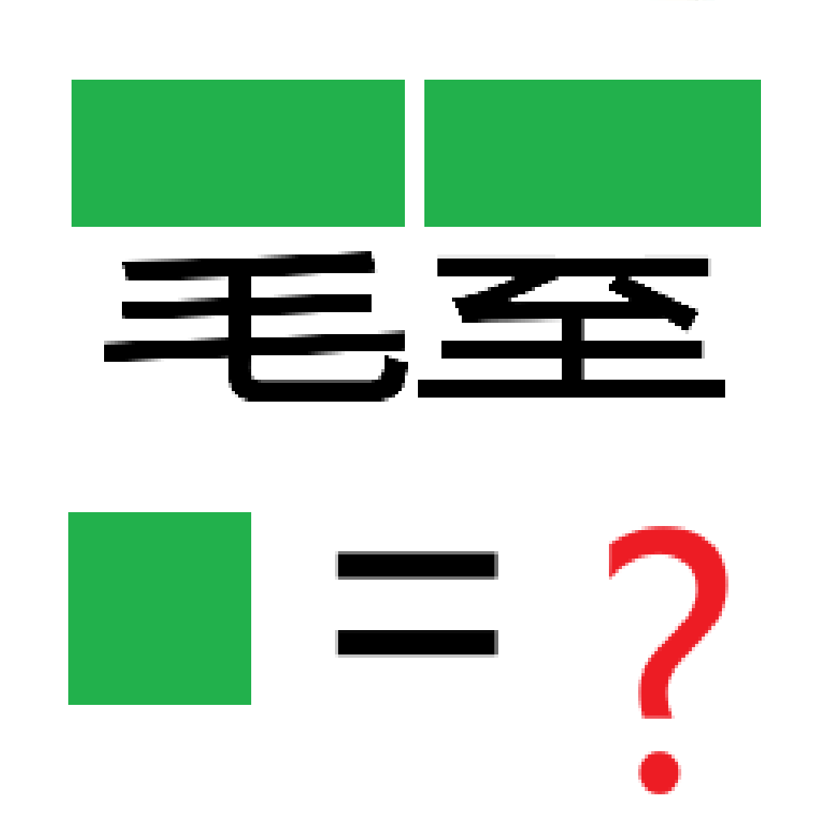

# 千字谜子题 41

## 题面

## 答案

`老`

## 解析

注意到【耄耋】，提取【老】

## 本地附件

- [16129c80ffe1443cb73524dad9666672.webp](../../../assets/static.cipherpuzzles.com/static/images/16129c80ffe1443cb73524dad9666672.webp)

来源：[https://ccbc16.cipherpuzzles.com/data/c16-qian-puzzle.json#cid=41](https://ccbc16.cipherpuzzles.com/data/c16-qian-puzzle.json#cid=41)
