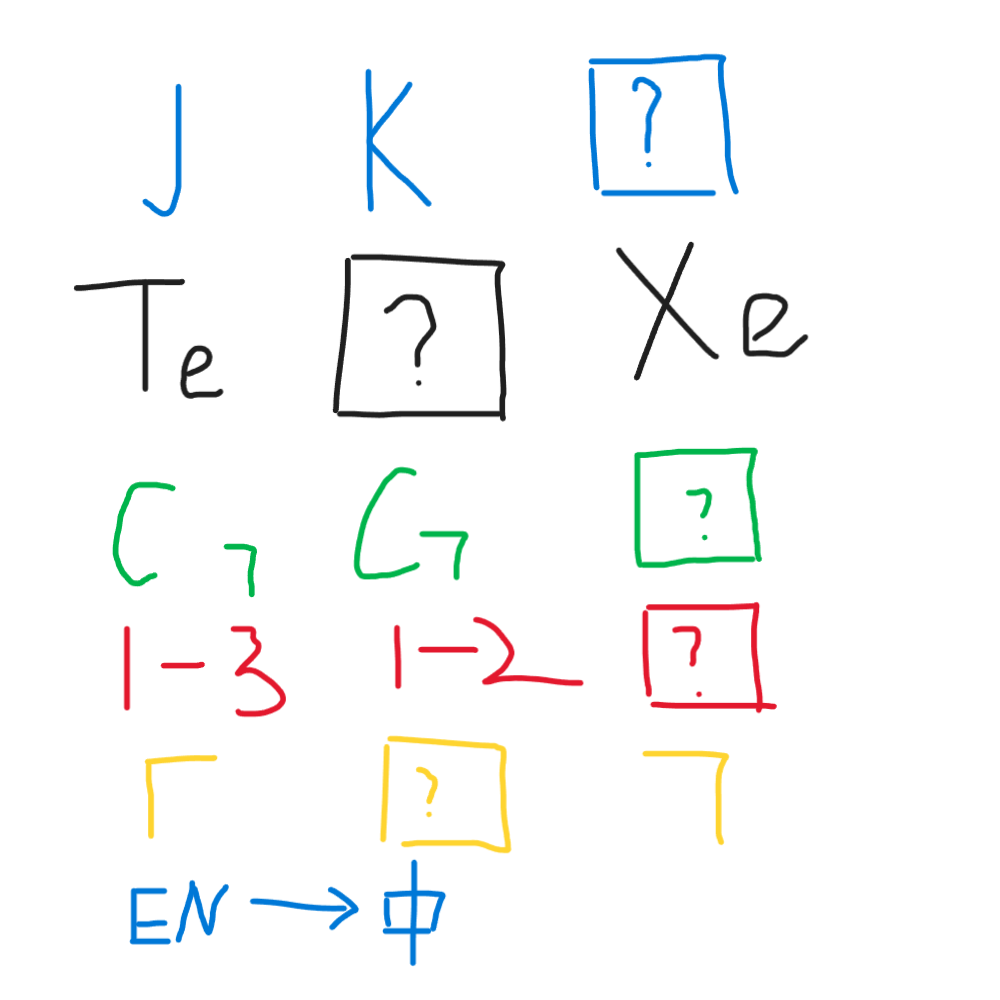

# 千字谜子题 410

## 题面

## 答案

`光`

## 解析

第一行：按字母顺序得到L
第二行：按元素周期表得到I
第三行：“7”向左平移得到G
第四行：1-1得到H
第五行：丨放在横中间得到T
翻译light得到光

## 本地附件

- [af7ddd744e0f484cb6522af0167fff4d.webp](../../../assets/static.cipherpuzzles.com/static/images/af7ddd744e0f484cb6522af0167fff4d.webp)

来源：[https://ccbc16.cipherpuzzles.com/data/c16-qian-puzzle.json#cid=410](https://ccbc16.cipherpuzzles.com/data/c16-qian-puzzle.json#cid=410)
