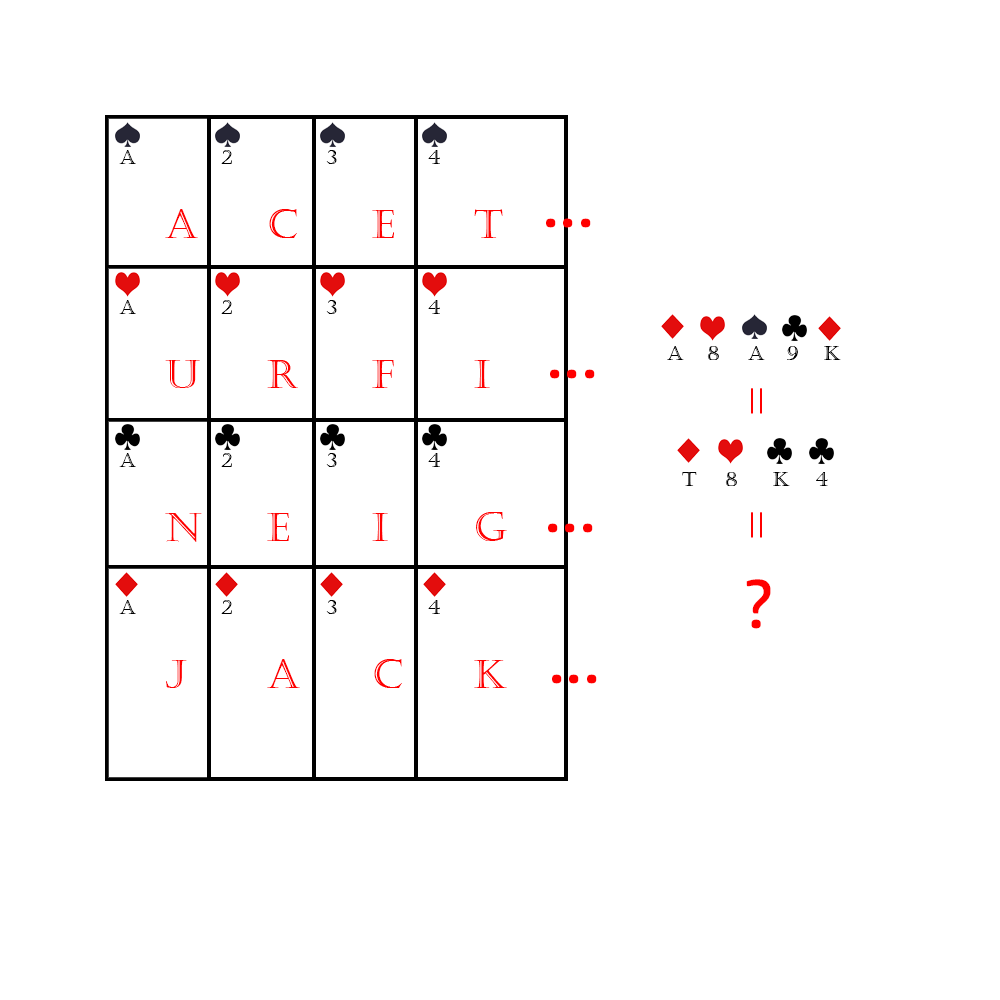

# 千字谜子题 411

## 题面

## 答案

`将`

## 解析

观察到ACE和JACK，考虑扑克牌点数的英文名称，发现ACE TWO …… JACK QUEN KING 正好52个字母，将其依次写出，就可以发现和给出的相符合，然后找到对应牌上的字母，右边则得到JIANG = KING = ?，问号代表回答一个字，于是得到答案将

## 本地附件

- [181c365b1b2f4665952f260eb1d652ca.webp](../../../assets/static.cipherpuzzles.com/static/images/181c365b1b2f4665952f260eb1d652ca.webp)

来源：[https://ccbc16.cipherpuzzles.com/data/c16-qian-puzzle.json#cid=411](https://ccbc16.cipherpuzzles.com/data/c16-qian-puzzle.json#cid=411)
