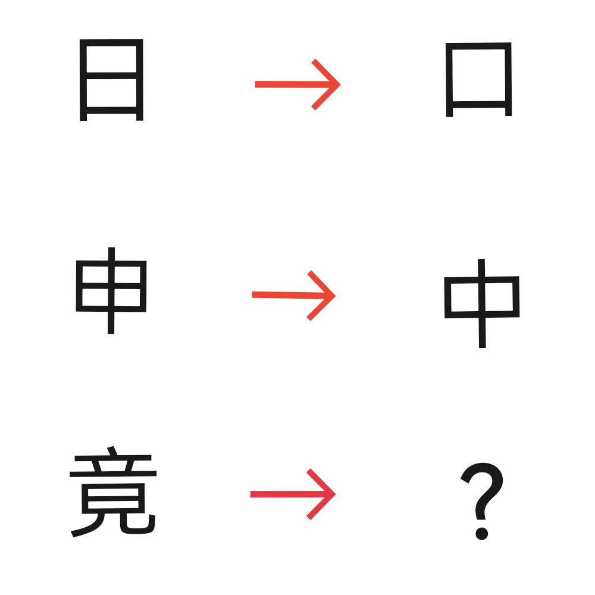

# 千字谜子题 412

## 题面

## 答案

`竞`

## 解析

由题目前两排可知，需要对汉字减去一笔得到一个新的汉字，因此对“竟”减去一笔即得到答案“竞”

## 本地附件

- [b825ca45aec6424abf9e33bc8cf1808d.webp](../../../assets/static.cipherpuzzles.com/static/images/b825ca45aec6424abf9e33bc8cf1808d.webp)

来源：[https://ccbc16.cipherpuzzles.com/data/c16-qian-puzzle.json#cid=412](https://ccbc16.cipherpuzzles.com/data/c16-qian-puzzle.json#cid=412)
