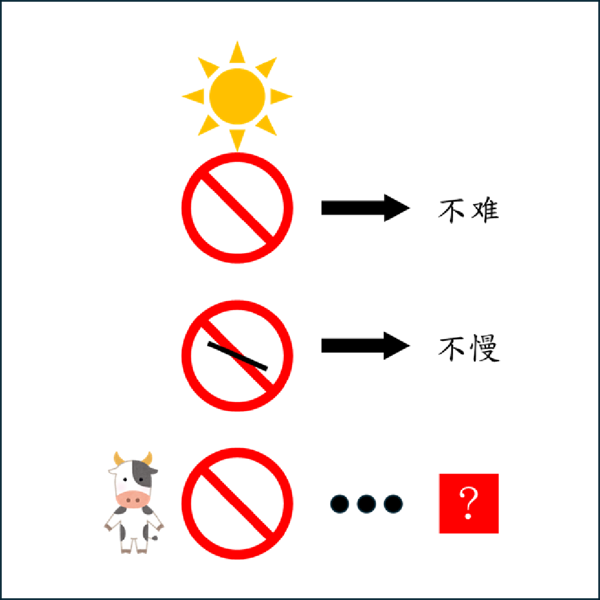

# 千字谜子题 413

## 题面

## 答案

`物`

## 解析

第一行，第二行分别代表了易，匆。由此可知禁止符号代表勿。第三行所组成的字即为答案「物」。

## 本地附件

- [d2703eb68da544e09b0fa8530f74ba82.webp](../../../assets/static.cipherpuzzles.com/static/images/d2703eb68da544e09b0fa8530f74ba82.webp)

来源：[https://ccbc16.cipherpuzzles.com/data/c16-qian-puzzle.json#cid=413](https://ccbc16.cipherpuzzles.com/data/c16-qian-puzzle.json#cid=413)
